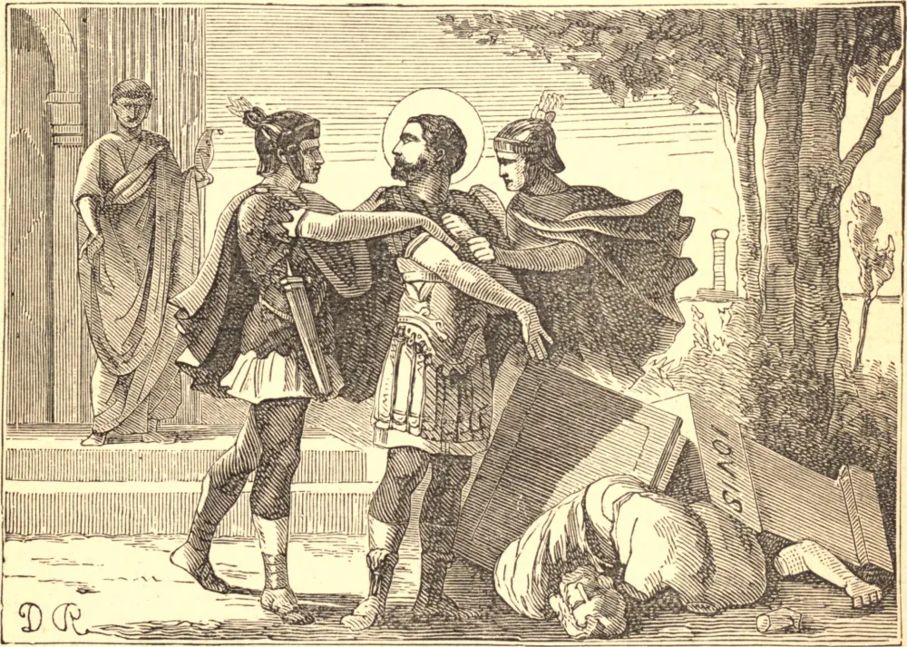

# 21 de julho — SÃO VÍTOR, Mártir

O Imperador Maximiano, ainda fumegante com o sangue da legião tebana e de muitos outros mártires, chegou a Marselha, onde a Igreja então florescia. O tirano não respirava ali senão matança e fúria, e sua chegada encheu os cristãos de temor e alarme. Nesta consternação geral, Vítor, um oficial cristão das tropas, ia de noite de casa em casa, visitando os fiéis e inspirando-lhes o desprezo de uma morte temporal e o amor da vida eterna. Foi surpreendido nisto, e levado diante dos prefeitos Astério e Eutíquio, que o exortaram a não perder o fruto de todos os seus serviços e o favor de seu príncipe pelo culto de um homem morto, como chamavam a Jesus Cristo. Respondeu que renunciava àquelas recompensas se não as pudesse gozar sem ser infiel a Jesus Cristo, o eterno Filho de Deus, que se dignou tornar-Se homem para nossa salvação, mas que Se ergueu dentre os mortos, e reina com o Pai, sendo Deus igualmente com Ele.

Toda a corte o ouviu com gritos de raiva. Vítor foi atado de pés e mãos e arrastado pelas ruas da cidade, exposto aos golpes e insultos da população. Foi trazido de volta machucado e ensanguentado ao tribunal dos prefeitos, que, pensando que sua resolução devia ter sido enfraquecida por seus sofrimentos, instaram-no novamente a adorar seus deuses. Mas o mártir, repleto do Espírito Santo, expressou seu respeito pelo imperador e seu desprezo por seus deuses. Foi então içado no potro e torturado por longo tempo, até que, estando os algozes enfim cansados, o prefeito ordenou que fosse descido e lançado num escuro calabouço.

À meia-noite, Deus o visitou por Seus anjos; a prisão encheu-se de uma luz mais brilhante do que a do sol, e o mártir cantava com os anjos os louvores de Deus. Três soldados que guardavam a prisão, vendo esta luz, lançaram-se aos pés do mártir, pediram-lhe perdão, e desejaram o Batismo. Vítor instruiu-os tanto quanto o tempo permitiu, mandou chamar sacerdotes naquela mesma noite, e, indo com eles à beira-mar, fê-los batizar, e voltou com eles novamente à sua prisão.

Na manhã seguinte Maximiano foi informado da conversão dos guardas, e num arrebatamento de raiva enviou oficiais para trazer todos os quatro diante dele. Os três soldados perseveraram na confissão de Jesus Cristo, e por ordem do imperador foram imediatamente decapitados. Vítor, depois de exposto aos insultos de toda a cidade e açoitado com varas e flagelado com correias de couro, foi levado de volta à prisão, onde permaneceu três dias, recomendando a Deus seu martírio com muitas lágrimas.

Findo esse prazo, o imperador chamou-o novamente diante de seu tribunal, e ordenou ao mártir que oferecesse incenso a uma estátua de Júpiter. Vítor aproximou-se do altar profano, e com um pontapé de seu pé derrubou-a. O imperador ordenou que o pé fosse imediatamente decepado, o que o Santo sofreu com grande alegria, oferecendo a Deus estas primícias de seu corpo. Poucos momentos depois, o imperador condenou-o a ser posto sob a mó de um moinho de mão e esmagado até a morte. Os executores giraram a roda, e quando parte de seu corpo estava machucada e esmagada, o moinho quebrou-se. O Santo ainda respirava um pouco, mas logo se ordenou que sua cabeça fosse cortada. Seu corpo e os dos outros três foram lançados ao mar, mas, sendo arrojados à praia, foram sepultados pelos cristãos numa gruta escavada numa rocha.
