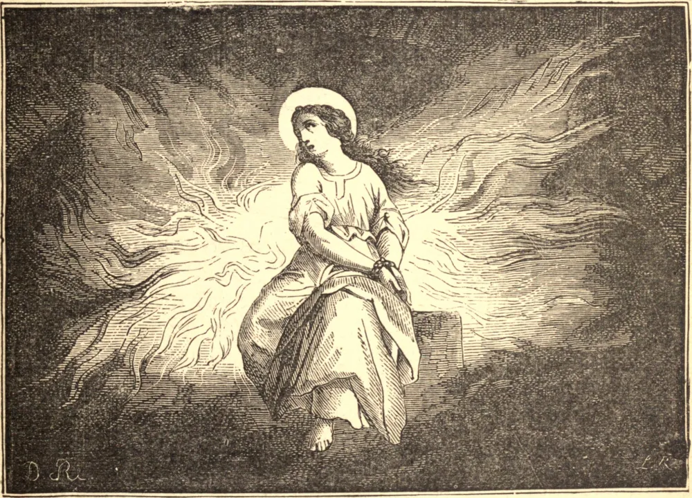

# 24 de julho — SANTA CRISTINA, Virgem e Mártir

SANTA CRISTINA era filha de um magistrado rico e poderoso chamado Urbano. Seu pai, profundamente entregue às práticas do paganismo, possuía vários ídolos de ouro, que nossa Santa destruiu, distribuindo os pedaços entre os pobres. Enfurecido por este ato, Urbano tornou-se o perseguidor de sua filha; mandou açoitá-la com varas e depois lançá-la num calabouço. Cristina permaneceu inabalável em sua fé.

Seu algoz mandou então dilacerar-lhe o corpo com ganchos de ferro e atou-a a um potro sob o qual se acendeu uma fogueira. Mas Deus velava por Sua serva e desviou as chamas sobre os espectadores. Cristina foi em seguida agarrada, atou-se-lhe uma pesada pedra ao pescoço e foi lançada no lago de Bolsena, mas foi salva por um anjo, e sobreviveu a seu pai, que morreu de despeito.

Mais tarde, esta mártir sofreu os mais desumanos tormentos sob o juiz que sucedeu a seu pai, e finalmente foi lançada numa fornalha ardente, onde permaneceu, ilesa, por cinco dias. Pelo poder de Cristo venceu as serpentes entre as quais foi lançada; depois cortaram-lhe a língua, e em seguida, traspassada por flechas, ganhou a coroa do martírio em Tiro, cidade que outrora se erguia numa ilha do lago de Bolsena na Itália, mas que há muito foi engolida pelas águas. Suas relíquias estão agora em Palermo, na Sicília.
