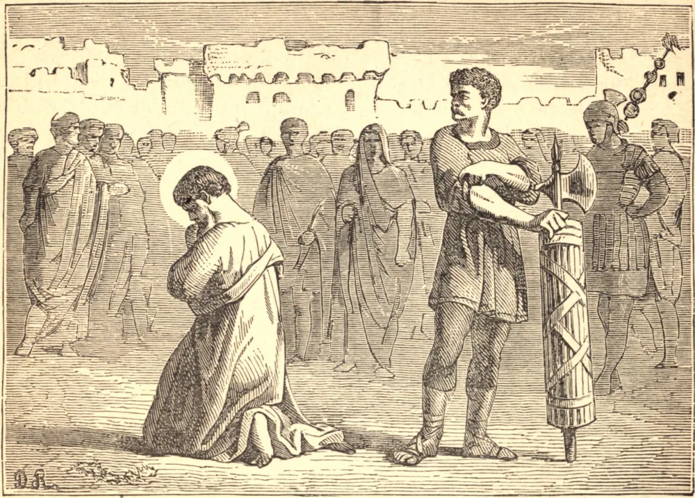

# 25 de julho — SÃO TIAGO, Apóstolo

DENTRE os doze, três foram escolhidos como os companheiros íntimos de nosso bendito Senhor, e destes Tiago era um. Só ele, com Pedro e João, foi admitido na casa de Jairo quando a jovem morta foi ressuscitada à vida. Só eles foram levados à parte ao alto monte, e viram a face de Jesus brilhar como o sol, e Suas vestes brancas como a neve; e somente estes três testemunharam a terrível agonia no Getsêmani. Que foi que conquistou a Tiago um lugar entre os três prediletos? A fé, ardente, impetuosa e franca, mas que precisava ser purificada antes que o "Filho do Trovão" pudesse proclamar o evangelho da paz. Foi Tiago quem pediu fogo do céu para consumir os inóspitos samaritanos, e quem buscou o lugar de honra junto a Cristo em Seu Reino. Contudo Nosso Senhor, ao repreender-lhe a presunção, profetizou sua fidelidade até a morte. Quando São Tiago foi levado perante o rei Herodes Agripa, sua intrépida confissão de Jesus crucificado de tal modo comoveu o promotor público que este se declarou cristão ali mesmo. Acusado e acusador foram apressadamente conduzidos juntos à execução, e pelo caminho este último implorou perdão ao Santo. O apóstolo já o havia perdoado há muito, mas hesitou por um momento se deveria aceitar publicamente como irmão alguém ainda não batizado. Deus prontamente lhe recordou a fé da Igreja, de que o sangue do martírio supre a todo sacramento, e, lançando-se ao pescoço de seu companheiro, abraçou-o, com as palavras: "A paz seja contigo!" Juntos então ajoelharam-se para a espada, e juntos receberam a coroa.

## Reflexão

Todos devemos desejar um lugar no reino de nosso Pai; mas podemos beber o cálice que Ele estende a cada um? *Possumus*, devemos dizer com São Tiago — "Podemos" — mas somente na força Daquele que o bebeu primeiro por nós.
