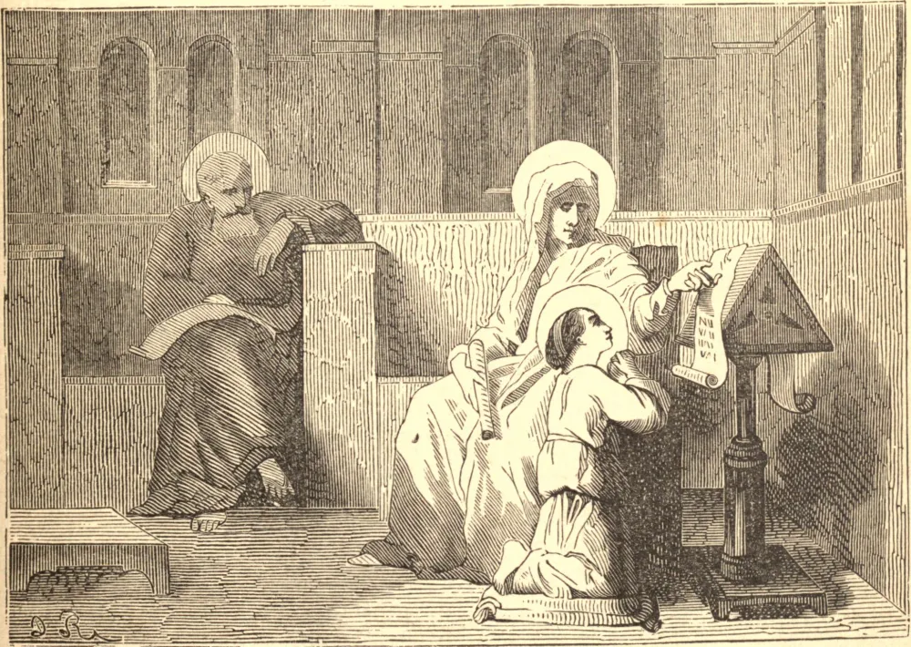

# 26 de julho — SANTA ANA

SANTA ANA era a esposa de São Joaquim, e foi escolhida por Deus para ser a mãe de Maria, Sua própria Mãe bendita na terra. Ambos eram da casa real de Davi, e suas vidas estavam inteiramente ocupadas em oração e boas obras. Uma só coisa faltava à sua união — não tinham filhos, e isto era tido como amarga desventura entre os judeus. Enfim, quando Ana já era mulher idosa, nasceu Maria, fruto antes da graça que da natureza, e criança mais de Deus que do homem. Com o nascimento de Maria a idosa Ana começou uma nova vida: observava cada movimento dela com reverente ternura, e sentia-se a cada hora santificada pela presença de sua criança imaculada. Mas ela havia consagrado sua filha a Deus, a Deus Maria se consagrara novamente, e a Ele Ana a entregou de volta. Maria tinha três anos quando Ana e Joaquim a conduziram pelos degraus do Templo, viram-na adentrar sozinha o santuário interior, e depois não a viram mais. Assim ficou Ana sem filha em sua solitária velhice, e privada de sua mais pura alegria terrena justamente quando dela mais precisava. Ela humildemente adorou a Vontade Divina, e começou de novo a velar e orar, até que Deus a chamou ao repouso sem fim junto ao Pai e ao Esposo de Maria, na morada do Filho de Maria.

## Reflexão

Santa Ana é gloriosa entre os Santos, não só como mãe de Maria, mas porque deu Maria a Deus. Aprende com ela a reverenciar uma vocação divina como o mais alto privilégio, e a sacrificar todo laço natural, por mais santo que seja, ao chamado de Deus.
