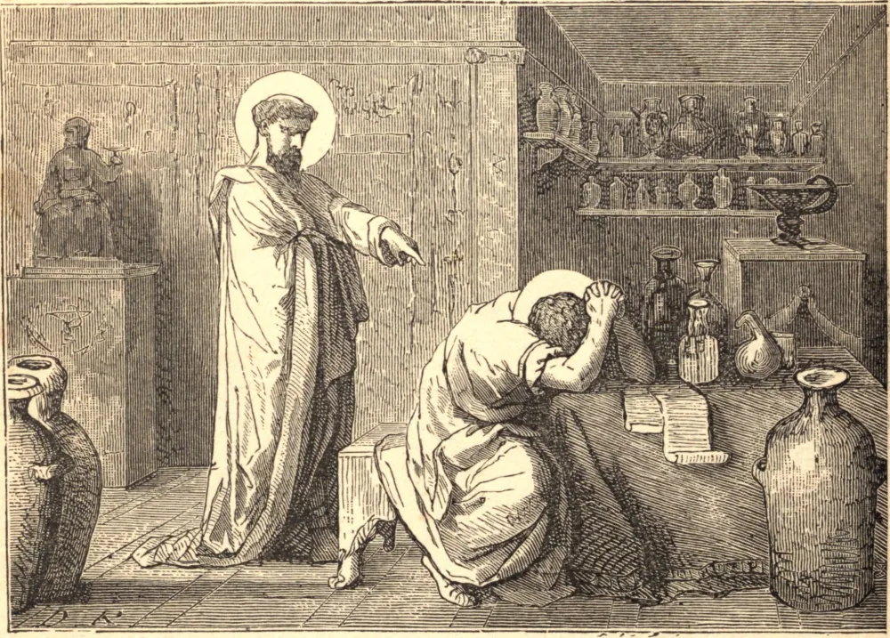

# 27 de julho — SÃO PANTALEÃO, Mártir

SÃO PANTALEÃO era médico do imperador Galério Maximiano, e cristão, mas, enganado por ouvir tantas vezes aplaudidas as falsas máximas do mundo, foi infelizmente seduzido a uma apostasia. Mas um zeloso cristão chamado Hermólao despertou sua consciência ao sentimento de sua culpa, e o trouxe de novo ao redil da Igreja. O penitente desejava ardentemente expiar seu crime pelo martírio; e para preparar-se para o combate, quando a sangrenta perseguição de Diocleciano irrompeu em Nicomédia, em 303, distribuiu todos os seus bens entre os pobres. Não muito depois deste ato foi preso, e em sua casa foram também presos Hermólao, Hermipo e Hermócrates. Após sofrerem muitos tormentos, foram todos condenados a perder a cabeça. São Pantaleão sofreu no dia seguinte ao dos demais. Suas relíquias foram trasladadas para Constantinopla, e ali guardadas com grande honra. A maior parte delas é hoje mostrada na abadia de São Dinis, perto de Paris, mas sua cabeça está em Lião.

## Reflexão

"Com os eleitos serás eleito, e com os perversos serás pervertido."
