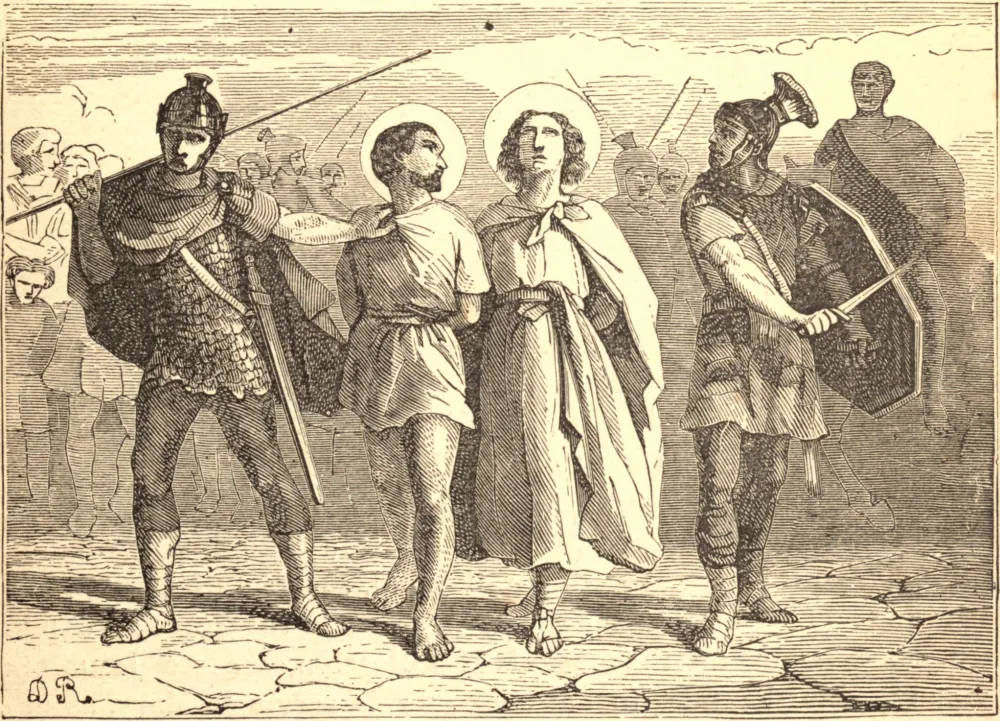

# 28 de julho — SÃO NAZÁRIO e SÃO CELSO, Mártires

O PAI de São Nazário era pagão, e ocupava um posto considerável no exército romano. Sua mãe, Perpétua, era zelosa cristã, e foi instruída por São Pedro, ou seus discípulos, nas mais perfeitas máximas de nossa santa fé. Nazário a abraçou com tanto ardor que copiou em sua vida todas as grandes virtudes que via em seus mestres; e por zelo pela salvação dos outros, deixou Roma, sua cidade natal, e pregou a Fé em muitos lugares com um fervor e desinteresse próprios de um discípulo dos apóstolos. Chegando a Milão, ali foi decapitado pela Fé, juntamente com Celso, um jovem que levara consigo para auxiliá-lo em suas viagens. Estes mártires sofreram pouco depois que Nero levantou a primeira perseguição.

Seus corpos foram sepultados separadamente num jardim fora da cidade, onde foram descobertos e exumados por Santo Ambrósio, em 395. No túmulo de São Nazário, achou-se uma ampola do sangue do Santo tão fresca e vermelha como se houvesse sido derramado naquele mesmo dia. Os fiéis mancharam lenços com algumas gotas, e formaram também com ele certa massa, parte da qual Santo Ambrósio enviou a São Gaudêncio, Bispo de Bréscia. Santo Ambrósio transportou os corpos dos dois mártires para a nova igreja dos apóstolos, que acabara de edificar. Uma mulher foi libertada de um espírito maligno na presença deles. Santo Ambrósio enviou algumas destas relíquias a São Paulino de Nola, que as recebeu com grande respeito, como o mais valioso presente, segundo ele próprio testemunha.

**Reflexão**—Os mártires morreram como párias do mundo, mas são coroados por Deus com honra imortal. A glória do mundo é falsa e transitória, e uma bolha ou sombra vazia, mas a da virtude é verdadeira, sólida e permanente, mesmo aos olhos dos homens.
