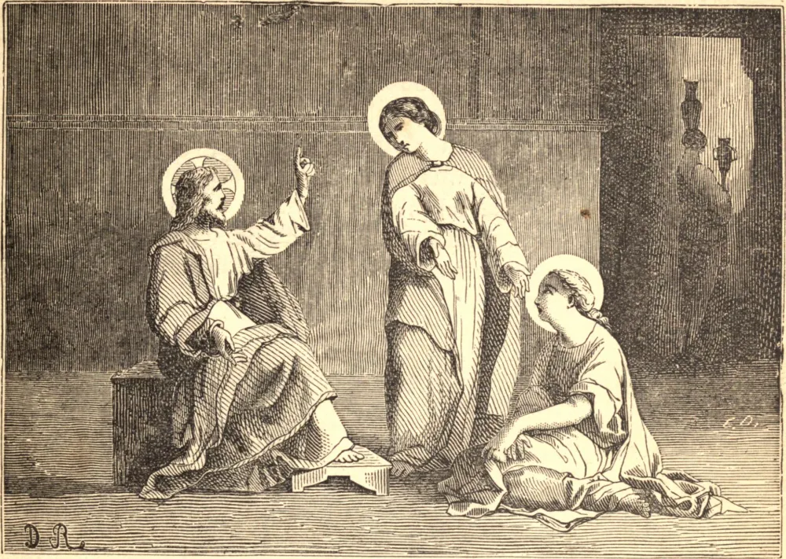

# 29 de julho — SANTA MARTA, Virgem

SÃO JOÃO nos diz que "Jesus amava Marta e Maria e Lázaro", e contudo apenas alguns vislumbres deles nos são concedidos. Primeiro, as irmãs nos são apresentadas com uma palavra. Marta recebeu Jesus em sua casa, e ocupava-se em um serviço exterior, amoroso e pródigo, enquanto Maria estava sentada em silêncio aos pés que ela banhara com suas lágrimas. Depois, seu irmão adoece, e elas mandam dizer a Jesus: "Senhor, aquele a quem amas está enfermo." E em Seu próprio tempo o Senhor veio, e elas saem ao Seu encontro; e então segue-se aquela cena de inefável ternura e de sublimidade insuperável: a silenciosa espera de Maria; Marta forte na fé, mas percebendo tão vividamente, com sua índole prática, o fato da morte, e hesitando: "Podes mostrar Tuas maravilhas no túmulo?" E então mais uma vez, na véspera de Sua Paixão, vemos Jesus em Betânia. Marta, fiel ao seu caráter, está servindo; Maria, como no princípio, derrama o precioso ungüento, em adoração e amor, sobre Sua divina cabeça. E então encontramos o túmulo de Santa Marta, em Tarascon, na Provença. Quando veio a tempestade da perseguição, a família de Betânia, com alguns companheiros, foi posta num barco, sem remos nem vela, e levada à costa da França. O túmulo de Santa Maria está em Sainte-Baume; São Lázaro é venerado como o fundador da Igreja de Marselha; e a memória das virtudes e trabalhos de Santa Marta ainda é fragrante em Avinhão e Tarascon.

## Reflexão

Quando Marta recebeu Jesus em sua casa, naturalmente se ocupou nos preparativos para tal Hóspede. Maria estava sentada a Seus pés, atenta unicamente a escutar Suas graciosas palavras. Sua irmã julgava que o momento exigia outro serviço que não este, e pediu a nosso Senhor que ordenasse a Maria que ajudasse a servir. Mais uma vez Jesus falou em defesa de Maria. "Marta, Marta", disse Ele, "andas amorosamente ansiosa por muitas coisas; não te apresses demais; faze a obra que escolheste com recolhimento. Não julgues Maria. A dela é a boa parte, a única coisa realmente necessária. A tua te será tirada, para que algo melhor te seja dado." A vida da ação cessa quando o corpo é deposto; mas a vida da contemplação perdura e se aperfeiçoa no céu.
