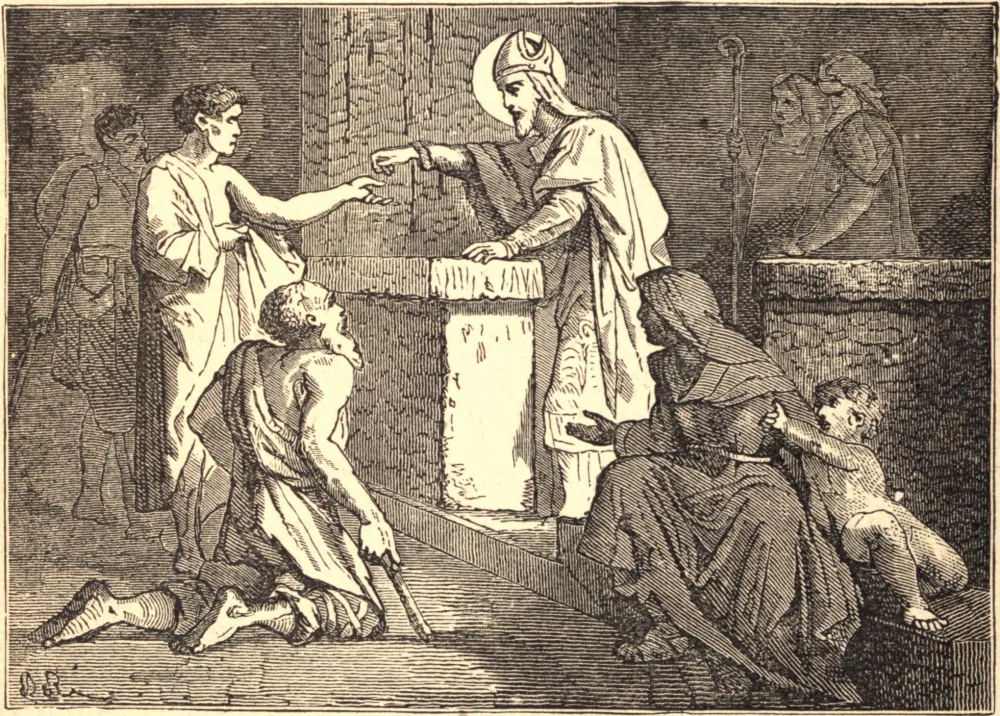

# 30 de julho — SÃO GERMANO, Bispo

EM sua juventude Germano dava poucos sinais de santidade. Era de nobre nascimento, e a princípio exerceu a advocacia em Roma. Depois de algum tempo o imperador o colocou em alto posto no exército. Mas sua única paixão era a caça. Deixava-se arrebatar a tal ponto que chegava a conservar em seus esportes as superstições dos caçadores pagãos. Contudo foi revelado ao Bispo de Auxerre que Germano seria seu sucessor, e este lhe deu a tonsura quase à força. Imediatamente Germano tornou-se outro homem, e, doando todas as suas terras à Igreja, adotou uma vida de humilde penitência.

Naquele tempo a heresia pelagiana assolava a Inglaterra, e Germano foi escolhido pelo Pontífice reinante para resgatar os bretões do laço de Satanás. Com São Lupo pregou pelos campos e pelas estradas por toda a terra. Por fim, perto de Verulâmio, defrontou-se face a face com os hereges, e venceu-os completamente com a fé católica e romana. Atribuiu este triunfo à intercessão de Santo Albano, e ofereceu públicas ações de graças em seu santuário.

Para o fim de sua estada, sua antiga perícia nas armas conquistou sobre os pictos e escotos a completa mas incruenta vitória "Aleluia", assim chamada porque os bretões recém-batizados, conduzidos pelo Santo, derrotaram o inimigo com o brado pascal. Germano visitou a Inglaterra uma segunda vez com São Severo. Morreu em 448, enquanto intercedia junto ao imperador pelo povo da Bretanha.

**Reflexão**—"Conserva o modelo das sãs palavras que de mim ouviste, na fé e no amor que está em Cristo Jesus" (II Tim. i. 13).
