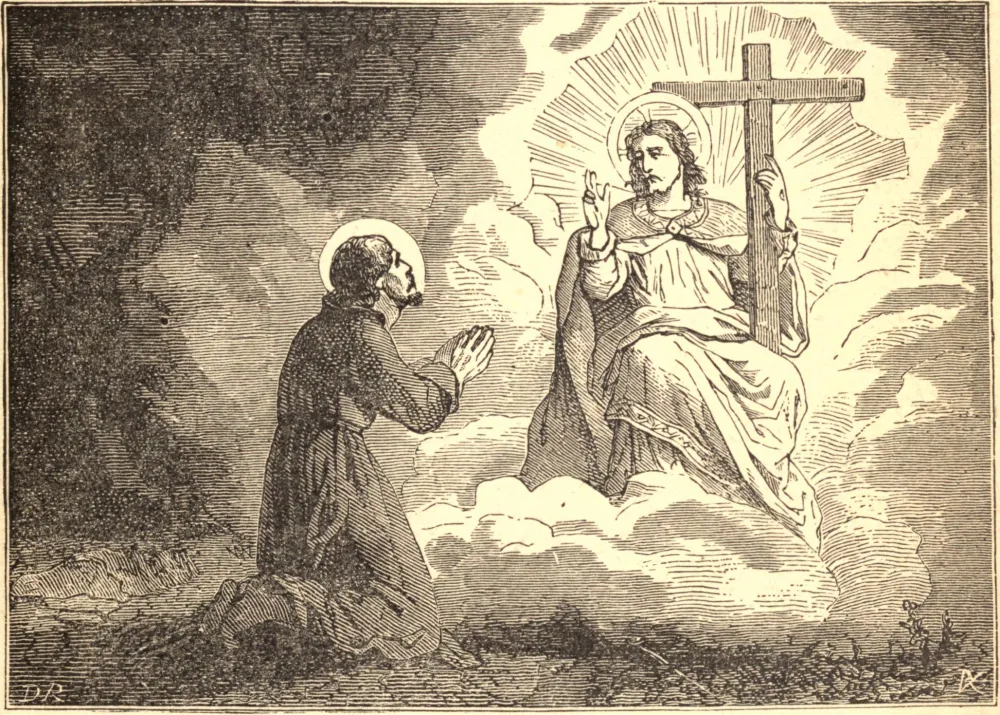

# 31 de julho — SANTO INÁCIO DE LOIOLA

SANTO INÁCIO nasceu em Loiola, na Espanha, no ano de 1491. Serviu a seu rei como cortesão e soldado até seu trigésimo ano. Nessa idade, prostrado por um ferimento, recebeu o chamado da graça divina para deixar o mundo. Abraçou a pobreza e a humilhação, para tornar-se mais semelhante a Cristo, e conquistou outros para se juntarem a ele no serviço de Deus.

Movidos por seu amor a Jesus Cristo, Inácio e seus companheiros fizeram um voto de ir à Terra Santa, mas a guerra irrompeu, e impediu a execução de seu projeto. Voltaram-se então para o Vigário de Jesus Cristo, e colocaram-se sob sua obediência. Este foi o início da Companhia de Jesus. Nosso Senhor prometeu a Santo Inácio que a preciosa herança de Sua Paixão jamais faltaria à sua Companhia, herança de contradições e perseguições.

Santo Inácio foi lançado na prisão em Salamanca, sob suspeita de heresia. A um amigo que lhe manifestou compaixão por causa de seu encarceramento, respondeu: "É sinal de que tendes apenas pouco amor de Cristo em vosso coração, ou não julgaríeis tão duro destino estar acorrentado por amor a Ele. Declaro-vos que toda Salamanca não contém tantos grilhões, algemas e correntes quantas anseio por usar pelo amor de Jesus Cristo." Santo Inácio foi para sua coroa no dia 31 de julho de 1556.

**Reflexão**—Peça a Santo Inácio que vos obtenha a graça de desejar ardentemente a maior glória de Deus, ainda que vos custe muito sofrimento e humilhação.
