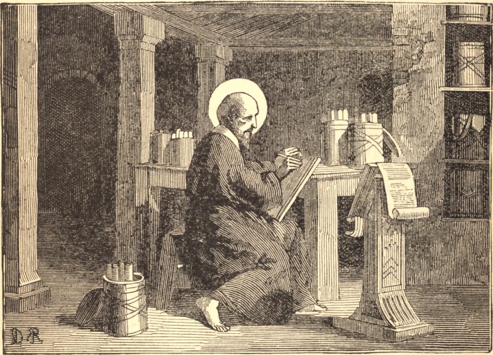

# 1 de junho — SÃO PÂNFILO, Mártir

SÃO PÂNFILO era de uma família rica e honrada, e natural de Berito, cidade que, naquele tempo, era famosa por suas escolas, onde, em sua juventude, percorreu todo o círculo das ciências, e depois foi honrado com os primeiros cargos da magistratura. Depois que começou a conhecer Cristo, não pôde apreciar outro estudo senão o da salvação, e renunciou a tudo o mais para que pudesse aplicar-se inteiramente ao exercício da virtude e ao estudo das Sagradas Escrituras. Este consumado mestre nas ciências profanas, e este renomado magistrado, não se envergonhou de tornar-se o humilde discípulo de Pierio, o sucessor de Orígenes na grande escola catequética de Alexandria. Depois fixou residência em Cesareia, na Palestina, onde, à sua própria custa, reuniu uma grande biblioteca, que doou à igreja daquela cidade. O Santo estabeleceu ali também uma escola pública de literatura sagrada, e aos seus labores deveu a Igreja uma edição corretíssima da Sagrada Bíblia, que, com infinito cuidado, ele próprio transcreveu. Mas nada havia de mais notável neste Santo do que a sua extraordinária humildade. Por fim, distribuiu entre os pobres a herança paterna; para com os seus escravos e domésticos, o seu comportamento foi sempre o de um irmão ou de um terno pai. Levou uma vida austeríssima, apartado do mundo e de sua companhia, e era infatigável no trabalho. Tal virtude foi o seu aprendizado para a graça do martírio. No ano 307, Urbano, o cruel governador da Palestina, mandou prendê-lo e ordenou que fosse atormentado da maneira mais desumana. Mas os ganchos de ferro que rasgavam os flancos do mártir não serviram senão para cobrir de confusão o juiz. Após isto, o Santo permaneceu quase dois anos no cárcere. Urbano, o governador, foi ele mesmo decapitado por ordem do Imperador Maximino, mas foi sucedido por Firmiliano, homem não menos bárbaro do que fanático e supersticioso. Após várias carnificinas, mandou trazer São Pânfilo à sua presença e proferiu contra ele sentença de morte. A sua carne foi arrancada até os próprios ossos, e as suas entranhas expostas à vista, e os tormentos prolongaram-se por longo tempo sem interrupção, mas ele nem uma só vez abriu a boca sequer para gemer. Concluiu o seu martírio sob fogo lento, e morreu invocando Jesus, o Filho de Deus.

## Reflexão

Uma nuvem de testemunhas, um nobre exército de mártires, ensinam-nos por sua constância a sofrer a injustiça com paciência e a resistir vigorosamente ao mal. As provações diárias que nos vêm dos outros ou de nós mesmos são-nos sempre enviadas por Deus, que às vezes lança dificuldades em nosso caminho de propósito para recompensar a nossa vitória; e às vezes, como um sábio médico, restitui-nos a saúde por meio de poções amargas.
