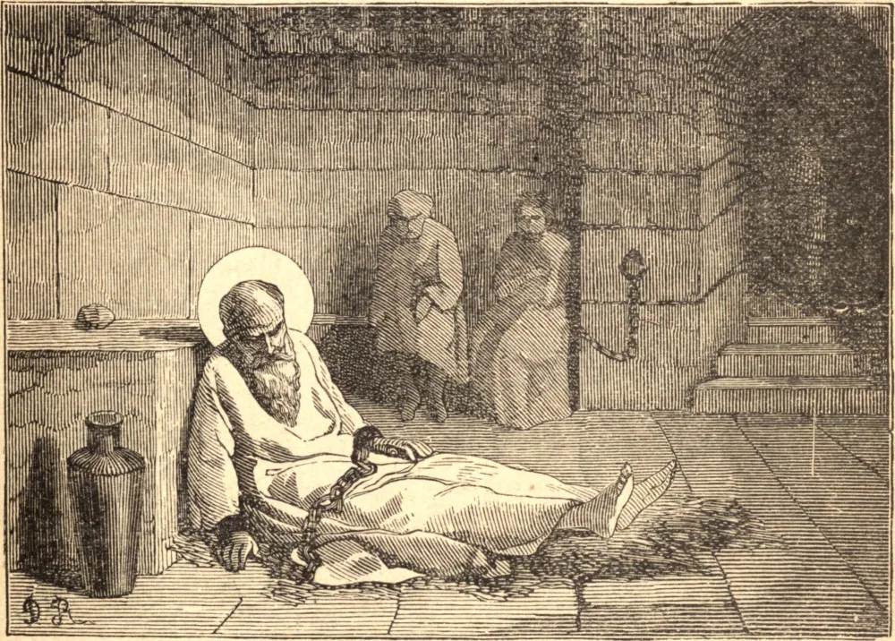

# 2 de junho — SÃO POTINO, Bispo, SANCTUS, ATALO, BLANDINA e os demais Mártires de Lião

APÓS a milagrosa vitória obtida pelas orações dos cristãos sob Marco Aurélio, em 174, a Igreja gozou de uma espécie de paz, embora fosse frequentemente perturbada em lugares particulares por comoções populares, ou pela fúria supersticiosa de certos governadores. Isto se evidencia pela violenta perseguição que se levantou três anos depois da referida vitória, em Vienne e Lião, em 177, enquanto São Potino era Bispo de Lião, e Santo Irineu, que havia sido enviado para lá por São Policarpo desde a Ásia, era sacerdote daquela cidade.

Muitos dos principais cristãos foram trazidos diante do governador romano. Entre eles havia uma escrava, Blandina; e a sua senhora, também cristã, temia que a Blandina faltasse força para enfrentar a tortura. Foi atormentada por um dia inteiro, mas suportou tudo com alegria, até que os carrascos desistiram, confessando-se vencidos. Placas em brasa eram aplicadas aos flancos de Sanctus, diácono de Vienne, até que o seu corpo se tornou uma só grande chaga, e ele não mais se parecia com um homem; mas, em meio aos seus tormentos, era "orvalhado e fortalecido pela corrente de água celeste que mana do lado de Cristo."

Entrementes, muitos confessores eram mantidos no cárcere, e com eles alguns que haviam sido aterrorizados até a apostasia. Mesmo os pagãos notavam a alegria do martírio nos cristãos que se ornavam para os seus eternos desposórios, e a miséria dos apóstatas. Mas os fiéis confessores reconduziram os que haviam caído, e a Igreja, "aquela Virgem Mãe," regozijou-se ao ver os seus filhos viverem novamente em Cristo. Alguns morreram no cárcere; os demais foram martirizados um a um, Santa Blandina por último de todos, depois de ver o seu irmão mais novo entregue a uma morte cruel, e de encorajá-lo à vitória.

**Reflexão**—Nos tempos primitivos, os cristãos eram chamados filhos da alegria. Busquemos a alegria do Espírito Santo para adoçar o sofrimento, para temperar o deleite terreno, até que entremos na alegria de Nosso Senhor.
