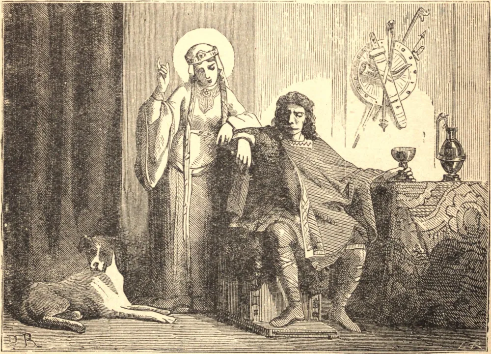

# 3 de junho — SANTA CLOTILDE, Rainha

SANTA CLOTILDE era filha de Quilperico, irmão mais novo de Gondebaldo, o tirânico Rei da Borgonha, que mandou matar a ele, à sua esposa e aos seus outros irmãos, exceto um, a fim de usurpar-lhes os domínios. Clotilde foi criada na corte de seu tio e, por uma singular providência, foi instruída na religião católica, embora tenha sido educada em meio aos arianos. O seu engenho, beleza, mansidão, modéstia e piedade fizeram dela a adoração de todos os reinos vizinhos, e Clóvis I, cognominado o Grande, o vitorioso rei dos francos, pediu-a e obteve-a em casamento. Ela honrou o seu real esposo, esforçou-se por adoçar o seu temperamento belicoso com a mansidão cristã, conformou-se ao seu humor nas coisas indiferentes e, para melhor ganhar-lhe o afeto, fazia dessas coisas o tema de seus discursos e elogios, naquilo em que sabia que ele encontrava o maior deleite. Quando se viu senhora de seu coração, não adiou a grande obra de procurar conquistá-lo para Deus, mas o receio de ofender o seu povo o fez retardar a sua conversão. A sua milagrosa vitória sobre os alamanos, e a sua conversão completa em 496, foram enfim o fruto das orações de nossa Santa. Clotilde, tendo ganho para Deus este grande monarca, nunca cessou de incitá-lo a ações gloriosas para a honra divina; entre outras fundações religiosas, ele edificou em Paris, a pedido dela, por volta do ano 511, a grande igreja de São Pedro e São Paulo, agora chamada de Santa Genoveva. Este grande príncipe morreu no dia 27 de novembro, no ano 511, com a idade de quarenta e cinco anos, tendo reinado trinta anos. O seu filho mais velho, Teodorico, reinou em Reims sobre as partes orientais da França, Clodomiro reinou em Orleans, Childeberto em Paris, e Clotário I em Soissons. Esta divisão produziu guerras e ciúmes mútuos, até que, em 560, toda a monarquia foi reunida sob Clotário, o mais novo desses irmãos. A dissensão em sua família contribuiu mais perfeitamente para desapegar o coração de Clotilde do mundo. Passou o restante de sua vida em exercícios de oração, esmolas, vigílias, jejum e penitência, parecendo esquecer completamente que havia sido rainha ou que os seus filhos ocupavam o trono. A eternidade enchia o seu coração e ocupava todos os seus pensamentos. Predisse a sua morte trinta dias antes que ela acontecesse. No trigésimo dia de sua enfermidade, recebeu os sacramentos, fez uma confissão pública de sua fé e partiu para o Senhor no dia 3 de junho de 545.

## Reflexão

São Pedro define a missão da mulher cristã: ganhar o coração daqueles que não creem na palavra.
