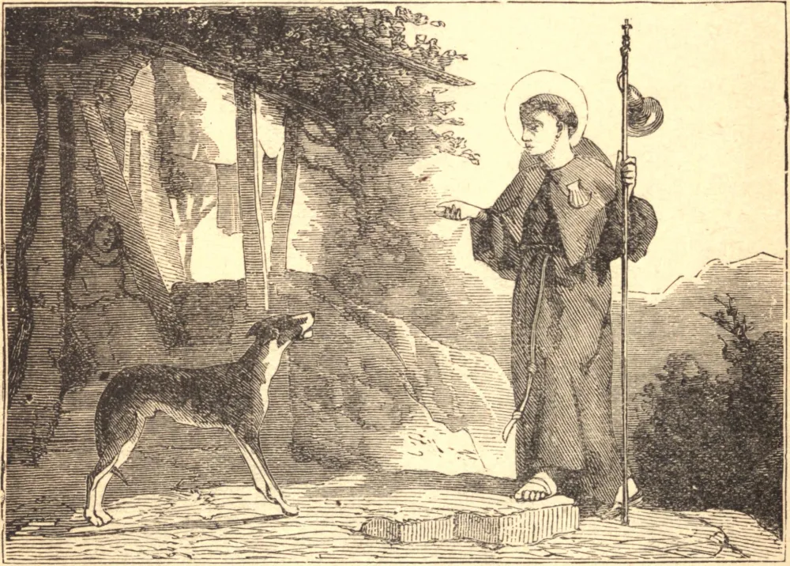

# 4 de junho — SÃO FRANCISCO CARACCIOLO

FRANCISCO nasceu no reino de Nápoles, da principesca família Caracciolo. Na infância, evitava todos os divertimentos, recitava o Rosário regularmente, e amava visitar o Santíssimo Sacramento e distribuir o seu alimento aos pobres. Um ataque de lepra ensinou-lhe a vileza do corpo humano e a vaidade do mundo.

Curado quase milagrosamente, renunciou ao seu lar para estudar para o sacerdócio em Nápoles, onde passava as suas horas de lazer nas prisões ou visitando o Santíssimo Sacramento em igrejas pouco frequentadas. Deus o chamou, quando tinha apenas vinte e cinco anos, a fundar uma Ordem de Clérigos Regulares, cuja regra era que cada dia um padre jejuasse a pão e água, outro tomasse a disciplina, um terceiro vestisse um cilício, enquanto velavam sempre por turnos em perpétua adoração diante do Santíssimo Sacramento. Faziam os votos habituais, acrescentando um quarto — o de não desejar dignidades. Para estabelecer a sua Ordem, Francisco empreendeu muitas viagens pela Itália e pela Espanha, a pé e sem dinheiro, contentando-se com o abrigo e os pedaços de pão que lhe davam por caridade.

Sendo eleito geral, redobrou as suas austeridades, e dedicava sete horas por dia à meditação sobre a Paixão, além de passar a maior parte da noite orando diante do Santíssimo Sacramento. Francisco era comumente chamado o Pregador do Divino Amor. Mas era diante do Santíssimo Sacramento que a sua ardente devoção mais claramente se percebia. Na presença de seu divino Senhor, o seu rosto costumava emitir brilhantes raios de luz; e frequentemente banhava o chão com as suas lágrimas quando orava, segundo o seu costume, prostrado de rosto em terra diante do tabernáculo, e repetindo constantemente, como quem é devorado por um fogo interior: "O zelo da Tua casa me devorou."

Morreu de febre, com a idade de quarenta e quatro anos, na véspera de Corpus Christi, em 1608, dizendo: "Vamos, vamos para o céu!" Quando o seu corpo foi aberto após a morte, encontrou-se o seu coração como que abrasado, e estas palavras impressas ao seu redor: "*Zelus domus Tuæ comedit me*" — "O zelo da Tua casa me devorou."

**Reflexão**—É pelos homens, e não pelos anjos, que Nosso bendito Senhor reside sobre o altar. Contudo, os anjos enchem as nossas igrejas para adorá-Lo, enquanto os homens O abandonam. Aprende com São Francisco a evitar tal ingratidão, e a passar, como ele passou, todo momento possível diante do Santíssimo Sacramento.
