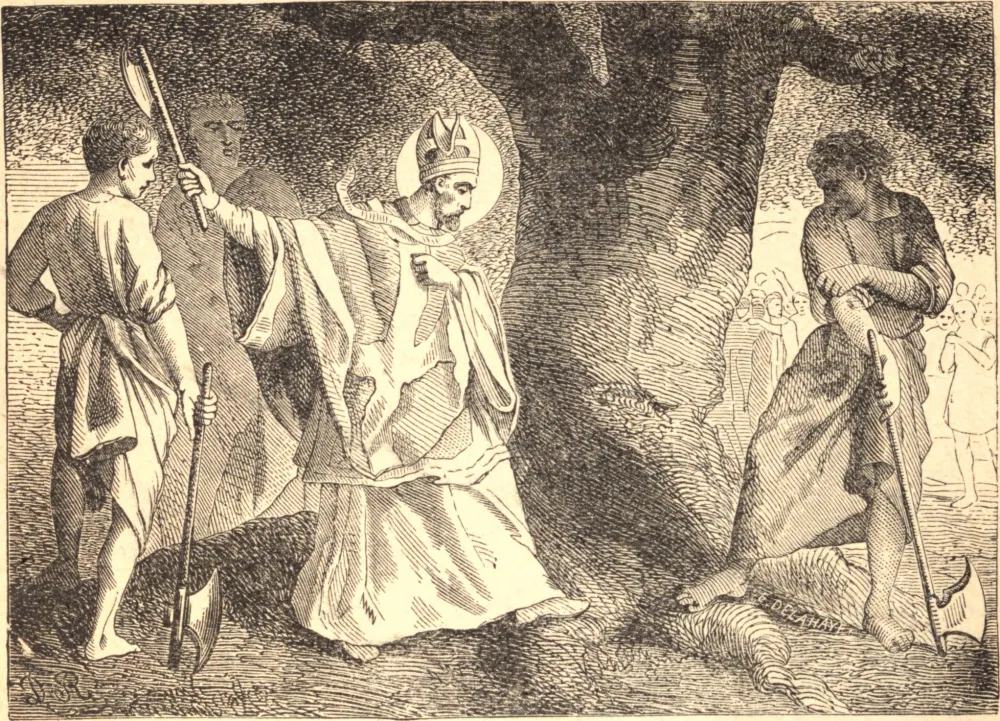

# 5 de junho — SÃO BONIFÁCIO, Bispo, Mártir

SÃO BONIFÁCIO nasceu em Crediton, em Devonshire, na Inglaterra, no ano 680. Alguns missionários hospedados na casa de seu pai falaram-lhe das coisas celestes, e inspiraram-lhe o desejo de devotar-se, como eles, a Deus. Entrou no mosteiro de Exminster, e ali foi formado para a sua obra apostólica. Tendo falhado a sua primeira tentativa de converter os pagãos da Holanda, foi a Roma obter a bênção do Papa sobre a sua missão, e regressou com autoridade para pregar às tribos germânicas.

Foi uma tarefa lenta e perigosa; a sua própria vida estava em constante perigo, enquanto o seu rebanho era frequentemente reduzido à mais abjeta pobreza pelos bandos errantes de ladrões. Contudo, a sua coragem jamais esmoreceu. Começou pela Baviera e pela Turíngia, em seguida visitou a Frísia, depois passou à Hessen e à Saxônia, por toda parte destruindo os templos dos ídolos e erguendo igrejas em seu lugar. Esforçava-se, na medida do possível, por fazer que cada objeto de idolatria contribuísse de algum modo para a glória de Deus; numa ocasião, tendo derrubado um imenso carvalho que era consagrado a Júpiter, usou a árvore na construção de uma igreja, que dedicou ao Príncipe dos Apóstolos.

Foi então chamado de volta a Roma, consagrado Bispo pelo Papa, e regressou para estender e organizar a nascente Igreja germânica. Com diligente cuidado, reformou os abusos entre o clero existente, e estabeleceu casas religiosas por toda a terra. Por fim, sentindo aumentarem as suas enfermidades, e temeroso de perder a sua coroa de mártir, Bonifácio nomeou um sucessor para o seu mosteiro, e partiu para converter uma nova tribo pagã.

Enquanto São Bonifácio esperava para administrar a Crisma a alguns cristãos recém-batizados, chegou um bando de pagãos, armados de espadas e lanças. Os seus acompanhantes quiseram opor-se-lhes, mas o Santo disse aos seus seguidores: "Meus filhos, cessai a vossa resistência; o dia há tanto esperado enfim chegou. A Escritura nos proíbe de resistir ao mal. Ponhamos a nossa esperança em Deus: Ele salvará as nossas almas." Mal acabara de falar, os bárbaros caíram sobre ele e o mataram, com todos os seus acompanhantes, no número de cinquenta e dois.

**Reflexão**—São Bonifácio ensina-nos como o amor de Cristo transforma todas as coisas. Foi por amor de Cristo que ele se afadigou pelas almas, preferindo a pobreza às riquezas, o trabalho ao repouso, o sofrimento ao prazer, a morte à vida, para que, morrendo, pudesse viver com Cristo.
