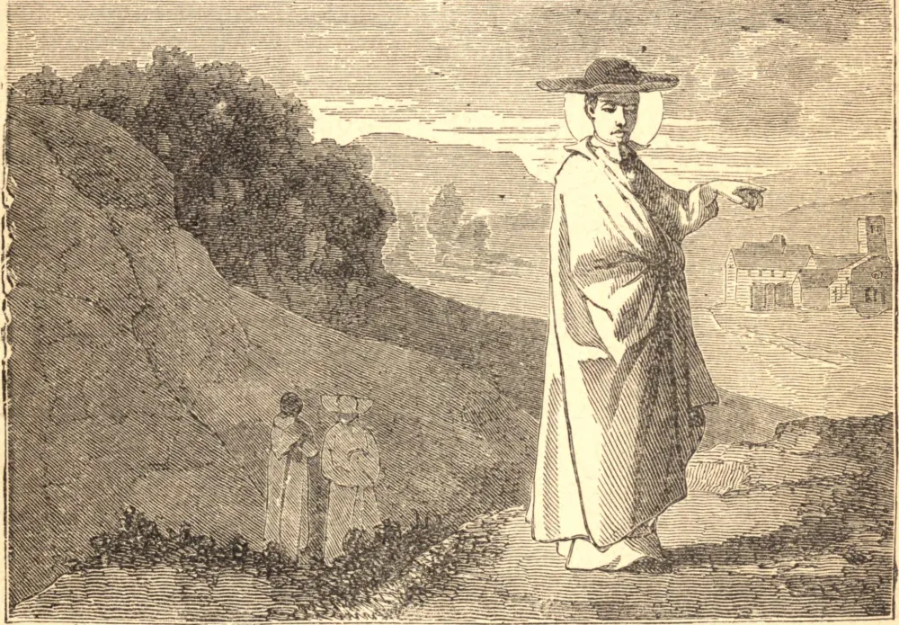

# 6 de junho — SÃO NORBERTO, Bispo

DE nobre estirpe e raros talentos, Norberto passou uma juventude piíssima, e entrou no estado eclesiástico. Por uma estranha contradição, a sua conduta tornou-se então um escândalo à sua sagrada vocação, e na corte do Imperador Henrique IV levou, como muitos clérigos daquela época, uma vida de dissipação e luxúria. Certo dia, quando tinha trinta anos de idade, foi lançado meio morto de seu cavalo e, ao recobrar os sentidos, resolveu-se por uma vida nova. Após uma severa e profunda preparação, foi ordenado sacerdote, e começou a expor os abusos de sua Ordem. Silenciado a princípio por um concílio local, obteve a sanção do Papa e pregou a penitência a multidões atentas na França e nos Países Baixos. No agreste vale de Prémontré, deu a alguns discípulos formados a regra de Santo Agostinho, e um hábito branco para denotar a angélica pureza própria do sacerdócio. Os Cônegos Regulares, ou *premonstratenses*, como eram chamados, deviam unir a obra ativa do clero rural às obrigações da vida monástica. O seu fervor renovou o espírito do sacerdócio, avivou a fé do povo e expulsou a heresia. Um vil herege, chamado Tankelin, apareceu em Antuérpia, no tempo de São Norberto, e negava a realidade do sacerdócio, e especialmente blasfemava contra a Santíssima Eucaristia. O Santo foi chamado para expulsar a praga. Com as suas palavras ardentes, desmascarou o impostor e reacendeu a fé no Santíssimo Sacramento. Muitos dos apóstatas haviam provado o seu desprezo pelo Santíssimo Sacramento, enterrando-o em lugares imundos. Norberto mandou-os procurar as Sagradas Hóstias. Encontraram-nas inteiras e ilesas, e o Santo levou-as de volta em triunfo ao tabernáculo. Por isso, é geralmente pintado com o ostensório na mão. Em 1126, Norberto viu-se nomeado Bispo de Magdeburgo; e ali, ao risco de sua vida, levou zelosamente adiante a sua obra de reforma, e morreu, exausto pelo labor, com a idade de cinquenta e três anos.

## Reflexão

A reparação pelas injúrias feitas ao Santíssimo Sacramento foi o alvo da grande obra de reforma de São Norberto — em si mesmo, no clero e nos fiéis. Quanto repara o nosso culto presente pelas nossas próprias irreverências passadas, e pelos ultrajes feitos por outros à Santíssima Eucaristia.
