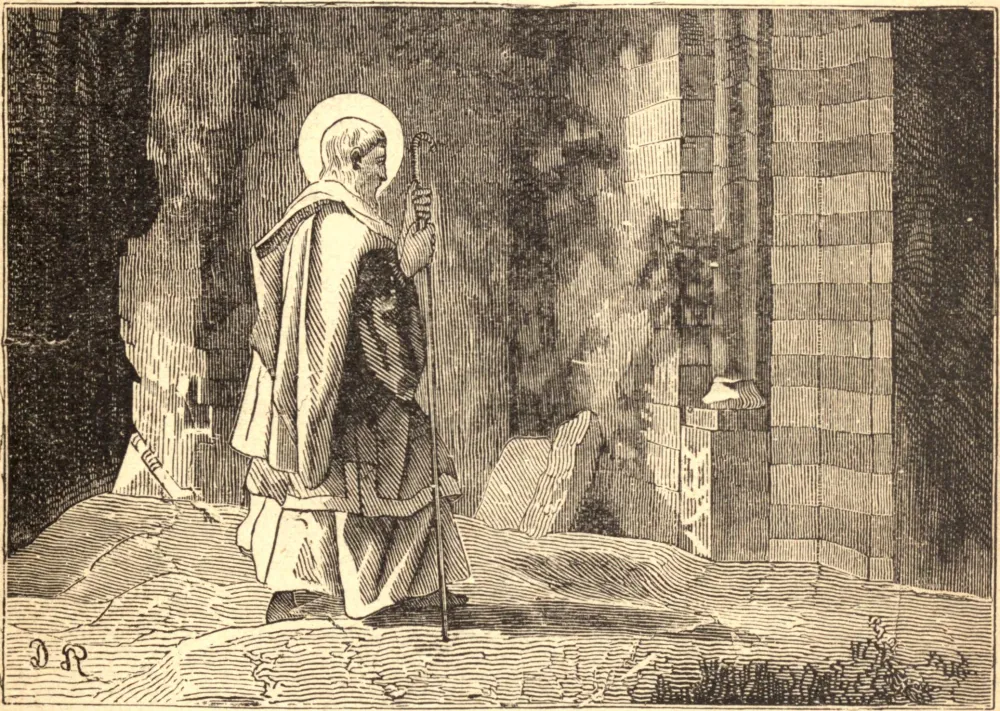

# 7 de junho — SÃO CLÁUDIO, Arcebispo

A província da Borgonha Oriental recebeu grande esplendor deste glorioso Santo. Nasceu em Salins, por volta do ano 603, e foi tanto o modelo quanto o oráculo do clero de Besançon, quando, por morte do Arcebispo Gervaise, por volta do ano 683, foi escolhido para ser o seu sucessor. Temendo as obrigações daquele encargo, fugiu e escondeu-se, mas foi descoberto e compelido a tomá-lo sobre si.

Durante sete anos, desempenhou as funções pastorais com o zelo e a vigilância de um apóstolo; mas, encontrando então uma oportunidade de renunciar à sua sé, que, por humildade e amor à solidão, sempre buscara, retirou-se para o grande mosteiro de São Oyend, e ali tomou o hábito monástico, em 690. Usou-se de violência para obrigá-lo, pouco depois, a aceitar a dignidade abacial.

Tal era a santidade de sua vida, e o seu zelo em conduzir os seus monges pelas sendas da perfeição evangélica, que mereceu ser comparado aos Antoninos e aos Pacômios, e o seu mosteiro aos do antigo Egito. O trabalho manual, o silêncio, a oração, a leitura de livros piedosos, especialmente a Sagrada Bíblia, o jejum, as vigílias, a humildade, a obediência, a pobreza, a mortificação, e a estreita união de seus corações com Deus, constituíam toda a ocupação destes fervorosos servos de Deus, e eram o rico patrimônio que São Cláudio deixou aos seus discípulos. Morreu em 703.
