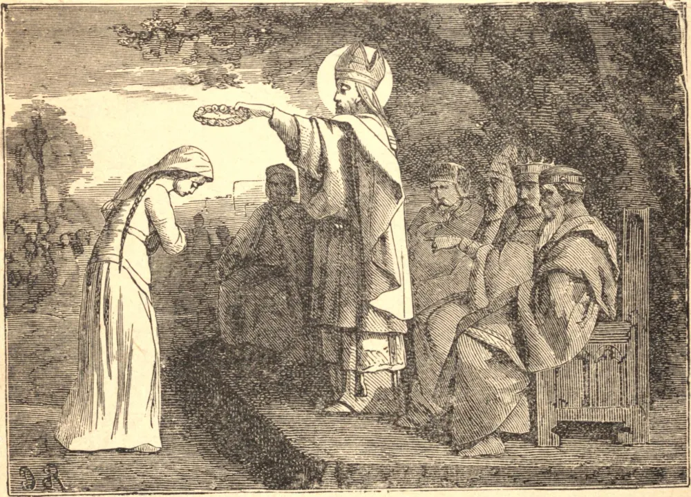

# 8 de junho — SÃO MEDARDO, Bispo

SÃO MEDARDO, um dos mais ilustres prelados da Igreja da França no século sexto, nasceu de uma família piedosa e nobre, em Salency, por volta do ano 457. Desde a infância, manifestou a mais terna compaixão pelos pobres. Em certa ocasião, deu o seu casaco a um cego desamparado, e, quando lhe perguntaram por que o havia feito, respondeu que a miséria de um companheiro de membro em Cristo de tal modo o comovia que não pôde deixar de dar-lhe parte de suas próprias vestes.

Sendo promovido ao sacerdócio no trigésimo terceiro ano de sua idade, tornou-se um brilhante ornamento daquela sagrada ordem. Pregava a palavra de Deus com uma unção que tocava os corações dos mais empedernidos; e a influência de seu exemplo, com o qual fazia valer os preceitos que proferia do púlpito, parecia irresistível. Em 530, morrendo Alomer, o décimo terceiro bispo daquela região, São Medardo foi unanimemente escolhido para ocupar a sé, e foi consagrado por São Remígio, que havia batizado o Rei Clóvis em 496, e era então de idade avançadíssima.

A nova dignidade de nosso Santo não o fez diminuir em nada das suas austeridades, e, embora então com setenta e dois anos de idade, julgou-se obrigado a redobrar os seus labores. Embora a sua diocese fosse muito extensa, parecia não bastar ao seu zelo, que não podia ser contido; onde quer que visse a oportunidade de promover a honra de Deus e de abolir os restos da idolatria, vencia todos os obstáculos, e, pelos seus zelosos labores e milagres, os raios do Evangelho dissiparam as névoas da idolatria por toda a extensão de sua diocese. O que tornava esta tarefa mais difícil e perigosa era a índole selvagem e feroz dos antigos habitantes de Flandres, que eram os mais bárbaros de todas as nações dos gauleses e dos francos.

Nosso Santo, tendo concluído esta grande obra em Flandres, regressou a Noyon, onde, pouco depois, adoeceu, e logo descansou de seus labores em idade avançada, em 545. Todo o reino lamentou a sua morte como a perda de seu pai e protetor comum. O seu corpo foi sepultado em sua própria catedral, mas os muitos milagres operados em seu túmulo de tal modo comoveram o Rei Clotário que ele transladou os preciosos restos para Soissons.

**Reflexão**—A Igreja deleita-se em chamar o seu fundador "O AMÁVEL JESUS," e Ele mesmo diz de Si: "Sou manso e humilde de coração."
