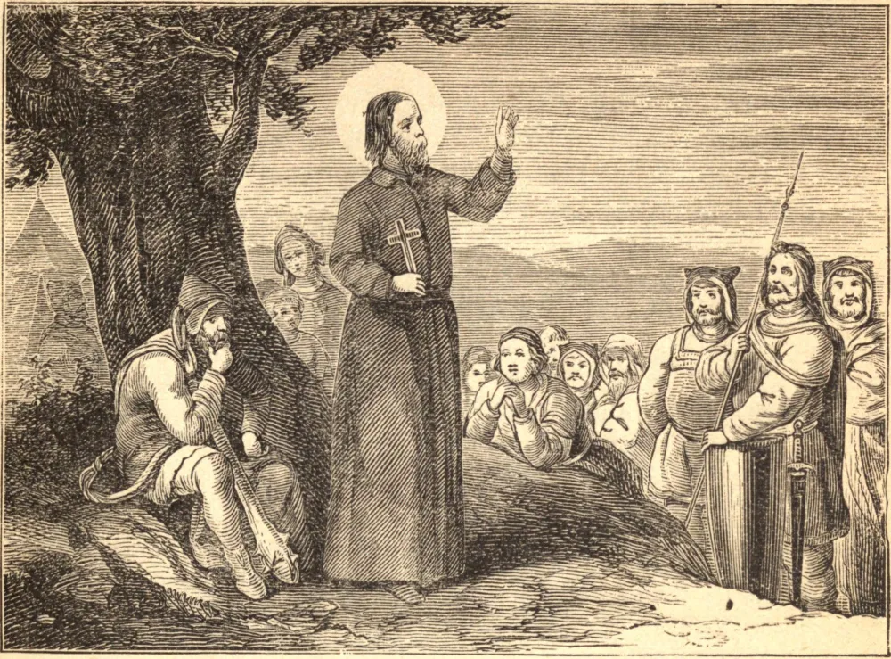

# SÃO COLUMBA, ou COLUMKILLE, Abade

SÃO COLUMBA, o apóstolo dos pictos, nasceu de uma família nobre, em Gartan, no condado de Tyrconnel, na Irlanda, em 521. Desde a primeira infância entregou-se a Deus. Em todos os seus trabalhos — e foram muitos — o seu pensamento principal era o céu e como deveria assegurar o caminho para lá. O resultado foi que jazia sobre o chão nu, com uma pedra por travesseiro, e jejuava o ano inteiro; contudo, a doçura de seu semblante revelava a serenidade interior daquela alma santa. Embora austero, não era taciturno; e, por mais que desejasse morrer, foi incansável nas boas obras durante toda a sua vida. Depois de ter sido feito abade, o seu zelo ofendeu o Rei Dermot; e em 565 o Santo partiu para a Escócia, onde fundou cem casas religiosas e converteu os pictos, que em gratidão lhe deram a ilha de Iona. Ali São Columba fundou o seu célebre mosteiro, escola de missionários e mártires apostólicos, e por séculos o último lugar de repouso de Santos e reis. Quatro anos antes de sua morte, o nosso Santo teve uma visão de anjos, que lhe disseram que o dia de sua morte havia sido adiado por quatro anos, em resposta às orações de seus filhos; ao que o Santo chorou amargamente e exclamou: "Ai de mim, que a minha peregrinação se prolonga!" pois desejava acima de todas as coisas alcançar a sua verdadeira pátria. Quão diferente é a conduta da maioria dos homens, que temem a morte acima de tudo, em vez de desejar "ser dissolvidos, e estar com Cristo"! No dia de sua morte serena, no septuagésimo sétimo ano de sua idade, rodeado no coro por seus filhos espirituais, no dia 9 de junho de 597, disse ao seu discípulo Diermit: "Este dia chama-se o Sábado, isto é, o dia de descanso, e tal será verdadeiramente para mim; pois porá fim aos meus trabalhos." Então, ajoelhando-se diante do altar, recebeu o Viático, e docemente adormeceu no Senhor. As suas relíquias foram levadas para Down, e depositadas no mesmo santuário com os corpos de São Patrício e Santa Brígida.

## Reflexão

O pensamento do mundo vindouro sempre nos fará felizes, e contudo rigorosos conosco mesmos em todos os nossos deveres. Quanto mais perfeitos nos tornarmos, tanto mais cedo contemplaremos aquilo pelo qual São Columba suspirava.
