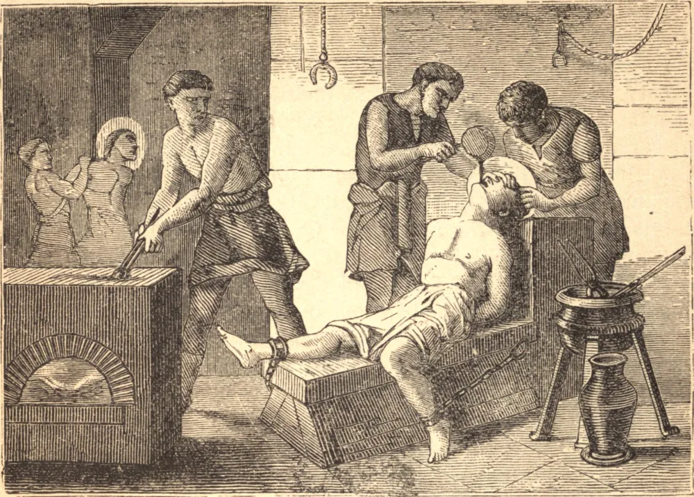

# 9 de junho — SÃO PRIMO e SÃO FELICIANO, Mártires

ESTES dois mártires eram irmãos e viveram em Roma, por volta da última parte do terceiro século, durante muitos anos, encorajando-se mutuamente na prática de todas as boas obras. Pareciam não possuir nada senão para os pobres, e muitas vezes passavam noites e dias inteiros com os confessores em seus cárceres, ou nos lugares de seus tormentos e execução. A alguns encorajavam à perseverança; a outros, que haviam caído, erguiam novamente; e faziam-se servos de todos em Cristo, para que todos pudessem alcançar a salvação por meio d'Ele. Embora o seu zelo fosse muito notável, haviam escapado dos perigos de muitas sangrentas perseguições, e haviam envelhecido nos heroicos exercícios da virtude, quando aprouve a Deus coroar os seus trabalhos com um glorioso martírio. Os pagãos levantaram tão grande clamor contra eles que ambos foram presos e postos em cadeias. Foram desumanamente açoitados e, em seguida, enviados a uma cidade a doze milhas de Roma para serem ainda mais castigados, como confessos inimigos dos deuses. Ali foram cruelmente torturados, primeiro ambos juntos, depois separadamente. Mas a graça de Deus os fortaleceu, e por fim ambos foram decapitados no dia 9 de junho.

## Reflexão

Uma alma que verdadeiramente ama a Deus considera como nada todas as coisas deste mundo. A perda dos bens, a desonra do mundo, os tormentos, a doença e outras aflições são amargos aos sentidos, mas parecem leves àquele que ama. Se não podemos suportar as nossas provações com paciência e silêncio, é porque amamos a Deus apenas em palavras. "Aquele que é preguiçoso e tíbio queixa-se de tudo, e chama duros os mais leves preceitos", diz Tomás de Kempis.
