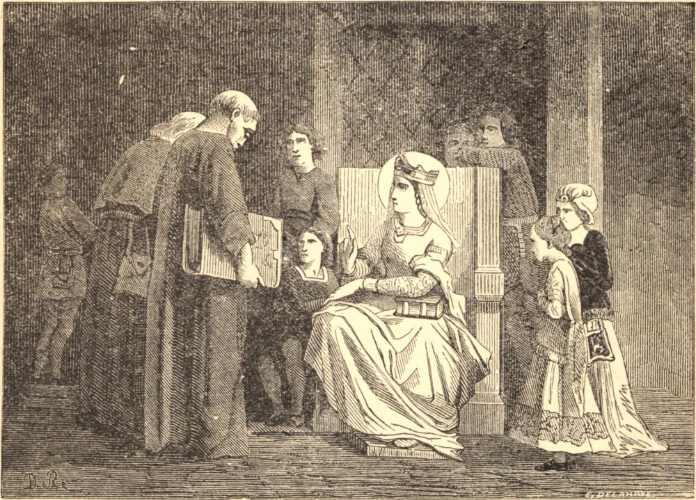

# 10 de junho — SANTA MARGARIDA DA ESCÓCIA

O nome de SANTA MARGARIDA significa "pérola"; "um nome adequado", diz Teodorico, seu confessor e primeiro biógrafo, "para alguém como ela". A sua alma era como uma preciosa pérola. Uma vida passada em meio ao luxo de uma corte real nunca embaçou o seu brilho, nem o roubou d'Aquele que o havia comprado com Seu sangue. Era neta de um rei inglês; e em 1070 tornou-se esposa de Malcolm, e reinou como Rainha da Escócia até a sua morte, em 1093. Como se tornou Santa numa posição em que a santidade é tão difícil? Primeiro, ardia de zelo pela casa de Deus. Edificava igrejas e mosteiros; ocupava-se em confeccionar paramentos; não podia descansar enquanto não visse as leis de Deus e de Sua Igreja observadas por todo o seu reino. Em seguida, em meio a mil cuidados, encontrava tempo para conversar com Deus — ordenando a sua piedade com tal doçura e discrição que conquistou o seu esposo para uma santidade semelhante à sua. Ele costumava levantar-se com ela à noite para a oração; gostava de beijar os livros santos que ela usava, e às vezes os furtava e os devolvia à esposa cobertos de joias. Por fim, com virtudes tão grandes, chorava constantemente sobre os seus pecados, e suplicava ao seu confessor que corrigisse as suas faltas. Santa Margarida não negligenciava os seus deveres no mundo por não ser do mundo. Nunca houve melhor mãe. Não poupou esforços na educação de seus oito filhos, e a santidade deles foi o fruto de sua prudência e de seu zelo. Nunca houve melhor rainha. Era a mais confiável conselheira de seu esposo, e trabalhava pela melhoria material do país. Mas, em meio aos prazeres do mundo, suspirava pela pátria melhor, e aceitou a morte como uma libertação. No seu leito de morte recebeu a notícia de que o seu esposo e o seu filho primogênito haviam sido mortos em batalha. Agradeceu a Deus, que lhe enviara esta última aflição como penitência por seus pecados. Após receber o Santo Viático, repetia a oração do Missal: "Ó Senhor Jesus Cristo, que por Tua morte deste vida ao mundo, livrai-me." Às palavras "livrai-me", diz o seu biógrafo, partiu para Cristo, o Autor da verdadeira liberdade.

## Reflexão

Toda a perfeição consiste em manter uma guarda sobre o coração. Onde quer que estejamos, podemos fazer uma solidão em nossos corações, desapegar-nos do mundo, e conversar familiarmente com Deus. Tomemos Santa Margarida como nosso exemplo e encorajamento.
