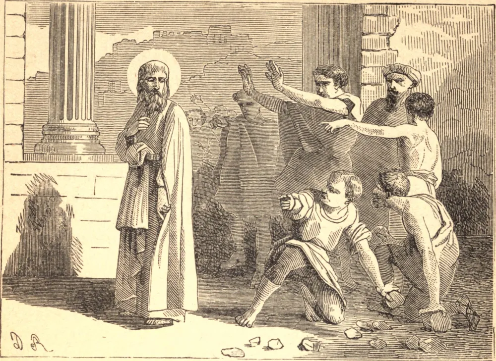

# 11 de junho — SÃO BARNABÉ, Apóstolo

LEMOS que nos primeiros dias da Igreja, "a multidão dos crentes tinha um só coração e uma só alma; nem ninguém dizia ser sua própria coisa alguma das que possuía". Desta fervorosa companhia, apenas um é distinguido pelo nome, José, um rico levita, de Chipre. "Tendo ele uma terra, vendeu-a, e trouxe o preço e o depositou aos pés dos apóstolos." Deram-lhe então um novo nome, Barnabé, o filho da consolação. Era um homem bom, cheio do Espírito Santo e de fé, e foi logo escolhido para uma importante missão junto à Igreja de Antioquia, que crescia rapidamente. Ali percebeu a grande obra que devia ser feita entre os gregos, de modo que se apressou em buscar São Paulo em seu retiro em Tarso. Foi em Antioquia que os dois Santos foram chamados ao apostolado dos gentios, e dali partiram juntos para Chipre e as cidades da Ásia Menor. A sua pregação enchia os homens de espanto, e alguns clamavam: "Os deuses desceram a nós em semelhança de homens", chamando Paulo de *Mercúrio*, e Barnabé de *Júpiter*. Os Santos viajaram juntos para o Concílio de Jerusalém, mas pouco depois disto separaram-se. Quando Ágabo profetizou uma grande fome, Barnabé, já não rico, foi escolhido pelos fiéis em Antioquia como o mais apto para levar, com São Paulo, as suas generosas ofertas à Igreja de Jerusalém. O brando Barnabé, mantendo consigo João, por sobrenome Marcos, de quem São Paulo desconfiava, dirigiu-se a Chipre, onde a história sagrada o deixa; e ali, num período posterior, ganhou a sua coroa do martírio.

## Reflexão

A vida de São Barnabé está cheia de sugestões para nós, que vivemos em dias nos quais, mais uma vez, as abundantes esmolas dos fiéis são duramente necessárias a toda a Igreja, desde o Soberano Pontífice até as pobres crianças de nossas ruas.
