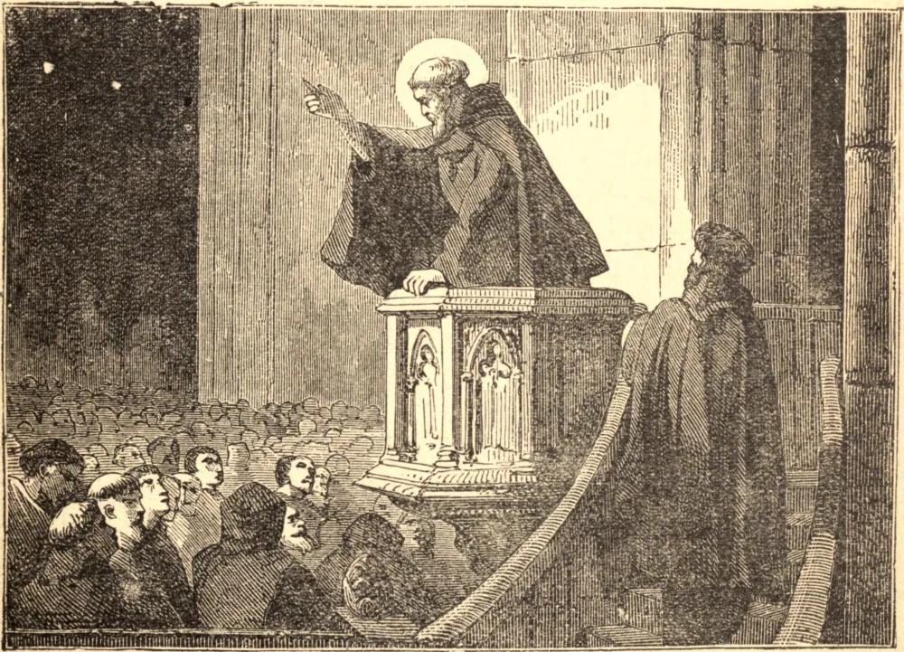

# 12 de junho — SÃO JOÃO DE SÃO FAGONDEZ

SÃO JOÃO nasceu em São Fagondez, na Espanha. Em tenra idade ocupava vários benefícios na diocese de Burgos, até que as censuras de sua consciência o forçaram a renunciar a todos eles, exceto uma capela, onde celebrava a Missa diariamente, pregava e catequizava. Depois disto estudou teologia em Salamanca, e então trabalhou por algum tempo como um devotíssimo sacerdote missionário. Por fim tornou-se eremita da Ordem Agostiniana, na mesma cidade. Ali a sua vida foi marcada por uma singular devoção à Santa Missa. Cada noite, após as Matinas, permanecia em oração até a hora da celebração, quando oferecia o Adorável Sacrifício com a mais terna piedade, gozando muitas vezes da visão de Jesus na glória, e mantendo doces colóquios com Ele. O poder de sua santidade pessoal manifestava-se em sua pregação, que produziu uma completa reforma em Salamanca. Tinha um dom especial de reconciliar desavenças, e foi capaz de pôr fim às contendas e rixas entre os nobres, naquele período muito comuns e fatais. A ousadia demonstrada por São João em repreender o vício pôs em perigo a sua vida. Um nobre poderoso, tendo sido corrigido pelo Santo por oprimir os seus vassalos, enviou dois assassinos para matá-lo. A santidade do aspecto do Santo, porém, causada por aquela paz que continuamente reinava em sua alma, incutiu tal temor em suas mentes que não puderam executar o seu intento, mas humildemente imploraram o seu perdão. E o próprio nobre, adoecendo, foi levado ao arrependimento, e recuperou a saúde pelas orações do Santo a quem havia tentado assassinar. Foi também muito zeloso em denunciar aqueles vícios horrendos que são fonte fecunda de discórdia, e foi em defesa da santa pureza que encontrou a sua morte. Uma dama de nobre nascimento mas de vida má, cujo companheiro no pecado São João havia convertido, tramou administrar um veneno fatal ao Santo. Após vários meses de terrível sofrimento, suportado com inalterável paciência, São João partiu para a sua recompensa em 11 de junho de 1479.

## Reflexão

Todos os homens desejam a paz, mas só a gozam aqueles que, como São João, estão completamente mortos para si mesmos, e amam suportar todas as coisas por Cristo.
