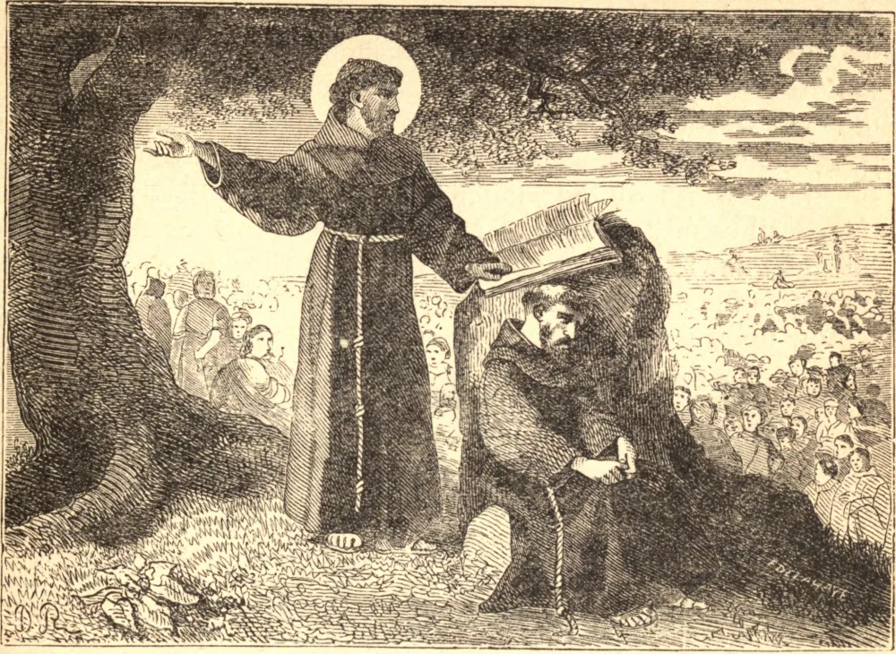

# 13 de junho — SANTO ANTÔNIO DE PÁDUA

EM 1221 São Francisco realizou um capítulo geral em Assis; quando os outros se dispersaram, ficou para trás, desconhecido e negligenciado, um pobre frade português, resolvido a pedir e a recusar nada. Nove meses depois, Frei Antônio levantou-se por obediência para pregar aos religiosos reunidos em Forli, quando, à medida que o discurso prosseguia, "o Martelo dos Hereges", "a Arca do Testamento", "o filho primogênito de São Francisco", revelou-se em toda a sua santidade, saber e eloquência diante de seus irmãos arrebatados e atônitos.

Dedicado desde a primeira juventude à oração e ao estudo entre os Cônegos Regulares, Fernando de Bulloens, como era o seu nome no mundo, fora movido, pelo espírito e exemplo dos primeiros cinco mártires franciscanos, a vestir o seu hábito e pregar a Fé aos mouros na África. Negada a palma do martírio, e debilitado pela doença, aos vinte e sete anos tomava silenciosa mas implacável vingança contra si mesmo nos mais humildes ofícios de sua comunidade. Desta obscuridade foi agora chamado, e por nove anos a França, a Itália e a Sicília ouviram a sua voz, viram os seus milagres, e os corações dos homens se voltaram para Deus.

Certa noite, quando Santo Antônio estava hospedado na casa de um amigo na cidade de Pádua, o seu anfitrião viu raios brilhantes saindo por baixo da porta do quarto do Santo, e, olhando pela fechadura, contemplou um Menino de maravilhosa beleza de pé sobre um livro que jazia aberto sobre a mesa, e abraçando com ambos os braços o pescoço de Antônio. Com uma inefável doçura observou as ternas carícias do Santo e do seu admirável Visitante. Por fim o Menino desapareceu, e Frei Antônio, abrindo a porta, ordenou ao seu amigo, pelo amor d'Aquele que ele vira, que "não contasse a visão a homem algum" enquanto ele vivesse.

Subitamente, em 1231, o breve apostolado do nosso Santo encerrou-se, e ouviram-se as vozes das crianças clamando pelas ruas de Pádua: "O nosso pai, Santo Antônio, morreu." No ano seguinte, os sinos das igrejas de Lisboa tocaram sem badaladores, enquanto em Roma um de seus filhos era inscrito entre os Santos de Deus.

**Reflexão**—Amemos orar e trabalhar despercebidos, e cultivemos no segredo de nossos corações as graças de Deus e o crescimento de nossas almas imortais. Como Santo Antônio, atendamos a isto, e deixemos o resto a Deus.
