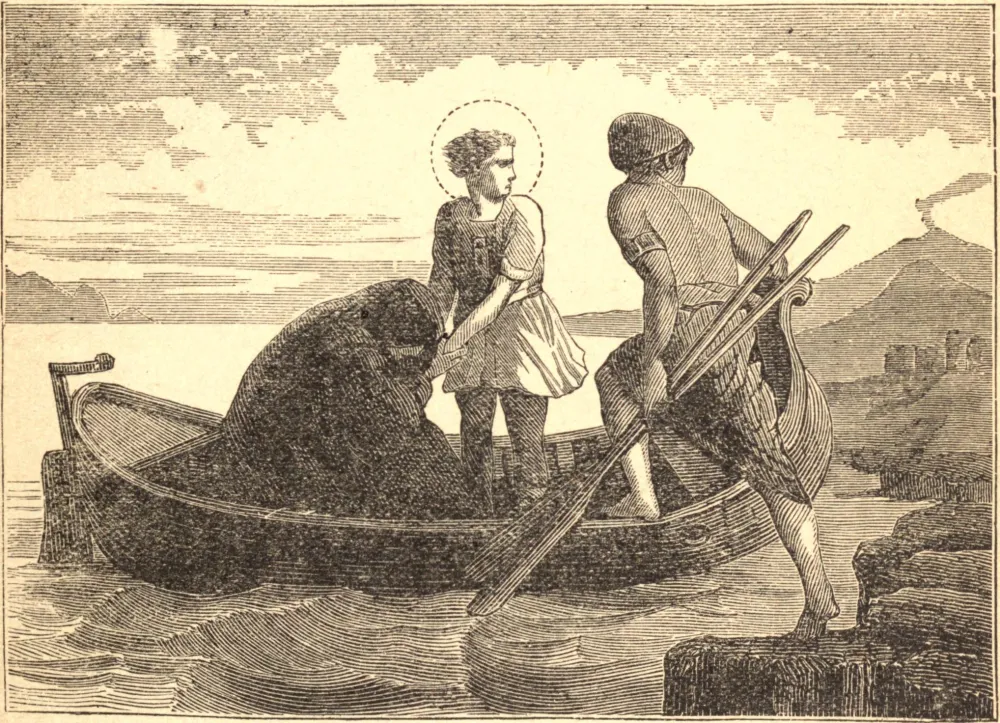

# 15 de junho — SÃO VITO, SANTA CRESCÊNCIA e SÃO MODESTO, Mártires

VITO era uma criança de nobre nascimento, que teve a felicidade de ser instruída na Fé, e inspirada com os mais perfeitos sentimentos de sua religião, por sua ama cristã, chamada Crescência, e o fiel esposo dela, Modesto.

O seu pai, Hilas, ficou extremamente indignado quando descobriu a invencível aversão da criança à idolatria; e, não conseguindo vencê-la com açoites e castigos semelhantes, entregou-a a Valeriano, o governador, que em vão tentou todas as suas artes para levá-la a ceder à vontade de seu pai e aos éditos do imperador. Escapou de suas mãos e, juntamente com Crescência e Modesto, fugiu para a Itália. Ali alcançaram a coroa do martírio na Lucânia, na perseguição de Diocleciano.

O heroico espírito de martírio que admiramos em São Vito deveu-se às primeiras impressões de piedade que ele recebeu das lições e do exemplo de uma ama virtuosa. De tão infinita importância é a escolha de preceptores, amas e servos virtuosos junto às crianças.

**Reflexão**—Que felicidade para uma criança ser formada naturalmente para toda virtude, e ter o espírito de simplicidade, mansidão, bondade e piedade moldado em sua tenra estrutura! Estando bem lançado tal fundamento, novas graças são abundantemente comunicadas, e uma alma aprimora diariamente estas sementes, e eleva-se à altura da virtude cristã, muitas vezes sem experimentar severos conflitos das paixões.
