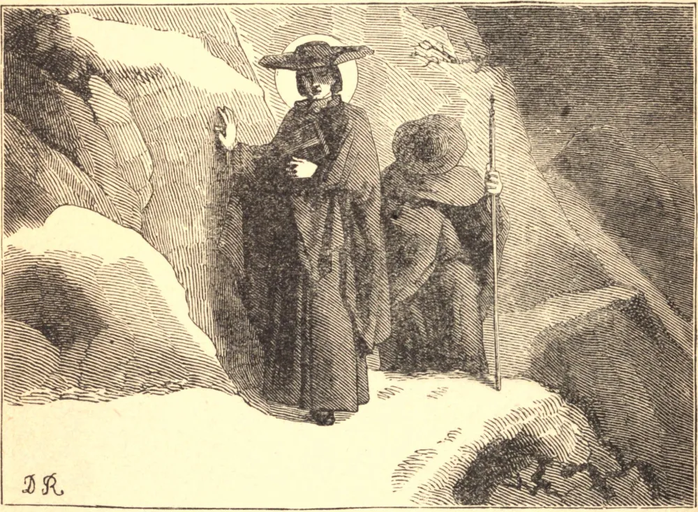

# 16 de junho — SÃO JOÃO FRANCISCO REGIS

SÃO JOÃO FRANCISCO REGIS nasceu no Languedoc, em 1597. Desde os seus mais tenros anos deu mostras de incomum santidade por sua inocência de vida, modéstia e amor à oração. Aos dezoito anos entrou na Companhia de Jesus. Tão logo terminaram os seus estudos, entregou-se inteiramente à salvação das almas. O inverno passava-o em missões pelo campo, principalmente em distritos montanhosos; e, apesar do rigor do tempo e da ignorância e rudeza dos habitantes, trabalhou com tanto êxito que ganhou para Deus inumeráveis almas, tanto da heresia quanto de uma vida má. O verão dedicava-o às cidades. Ali o seu tempo era ocupado em visitar hospitais e prisões, em pregar e instruir, e em socorrer todos os que de algum modo necessitavam de seus serviços. Em suas obras de misericórdia Deus muitas vezes o ajudou com milagres. Em novembro de 1637, o Santo partiu para a sua segunda missão em Marthes. O seu caminho estendia-se por vales cobertos de neve e por montanhas geladas e escarpadas. Ao escalar uma das mais altas, um arbusto ao qual se agarrava cedeu, e ele quebrou a perna na queda. Com o auxílio de seu companheiro percorreu as seis milhas restantes, e então, em vez de procurar um cirurgião, insistiu em ser levado diretamente ao confessionário. Ali, após várias horas, o cura da paróquia encontrou-o ainda sentado, e quando a sua perna foi examinada, descobriu-se que a fratura estava miraculosamente curada. Estava tão inflamado pelo amor de Deus que parecia respirar, pensar e falar apenas d'Ele, e oferecia o Santo Sacrifício com tal atenção e fervor que aqueles que dele participavam não podiam deixar de sentir algo do fogo com que ardia. Após doze anos de incessante labor, entregou a sua alma pura e inocente ao seu Criador, aos quarenta e quatro anos de idade.

## Reflexão

Quando São João Francisco foi golpeado no rosto por um pecador a quem repreendia, respondeu: "Se tu apenas me conhecesses, dar-me-ias muito mais do que isso." A sua mansidão converteu o homem, e é neste espírito que ele nos ensina a ganhar almas para Deus. Quanto poderíamos fazer se pudéssemos esquecer as nossas próprias necessidades ao lembrar as dos outros, e pôr a nossa confiança em Deus!
