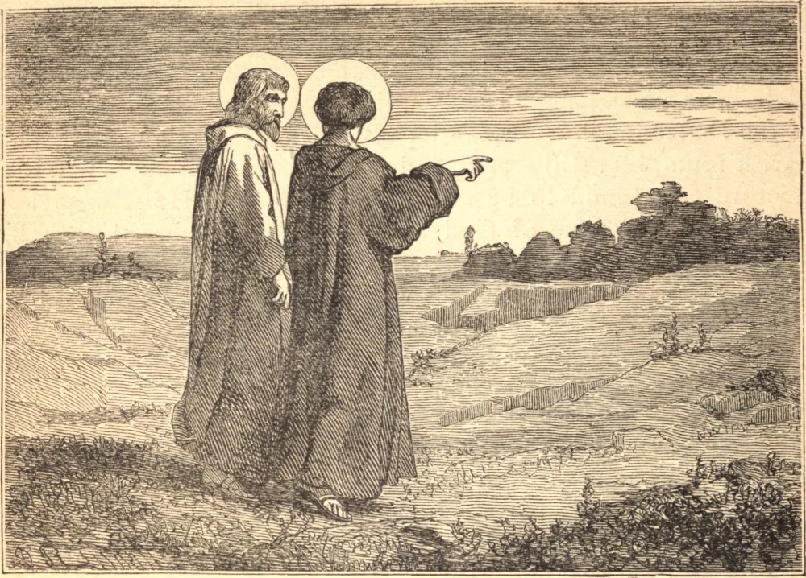

# 17 de junho — SANTO ÁVITO, Abade

SANTO ÁVITO era natural de Orleans e, retirando-se para a Auvérnia, tomou o hábito monástico, juntamente com São Calais, na abadia de Menat, naquele tempo muito pequena, embora depois enriquecida pela Rainha Brunehault, e por São Boner, Bispo de Clermont. Os dois Santos logo em seguida regressaram a Miscy, uma famosa abadia situada a uma légua e meia abaixo de Orleans. Foi fundada por volta do fim do reinado de Clóvis I por São Euspício, um santo sacerdote, honrado no dia 14 de junho, e seu sobrinho São Maximino ou Mesnim, cujo nome este mosteiro, que é agora da Ordem Cisterciense, leva. Muitos chamam São Maximino o primeiro abade, outros São Euspício o primeiro, São Maximino o segundo, e Santo Ávito o terceiro. Mas o nosso Santo e São Calais não fizeram longa estada em Miscy, embora São Maximino lhes tenha dado gracioso acolhimento. Em busca de um retiro mais recolhido, Santo Ávito, que havia sucedido a São Maximino, logo em seguida renunciou ao abadiado, e com São Calais viveu como recluso no território agora chamado Dunois, nas fronteiras de La Perche. Tendo outros se juntado a eles, São Calais retirou-se para uma floresta no Maine, e o Rei Clotário edificou uma igreja e um mosteiro para Santo Ávito e seus companheiros. Este é atualmente um convento de freiras beneditinas, chamado Santo Ávito de Chateaudun, e está situado às margens do Loire, ao pé da colina sobre a qual a cidade de Chateaudun foi construída, na diocese de Chartres. Três famosos monges, Leobino, depois Bispo de Chartres, Eufrônio e Rústico, assistiram o nosso Santo em sua feliz morte, ocorrida por volta do ano 530. O seu corpo foi levado para Orleans, e sepultado com grande pompa naquela cidade.
