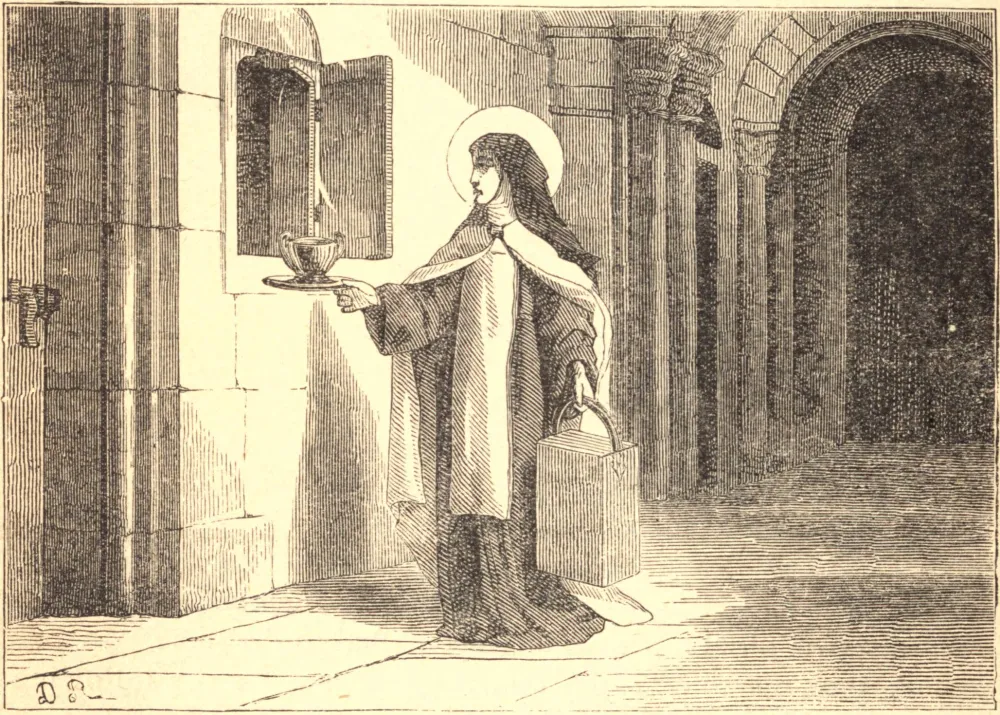

# 19 de junho — SANTA JULIANA FALCONIERI

JULIANA FALCONIERI nasceu em resposta a uma oração, em 1270. O seu pai edificou a esplêndida igreja da Annunziata em Florença, enquanto o seu tio, o Beato Aléxio, tornou-se um dos fundadores da Ordem dos Servitas. Sob os cuidados deste, Juliana cresceu, como ele dizia, mais semelhante a um anjo do que a um ser humano. Tamanha era a sua modéstia que nunca usou um espelho nem contemplou o rosto de um homem durante toda a sua vida. A simples menção do pecado a fazia estremecer e tremer, e certa vez, ao ouvir relatar um escândalo, caiu em profundo desmaio. A sua devoção às dores de Nossa Senhora atraiu-a aos Servos de Maria; e, aos catorze anos, recusou uma proposta de casamento, e recebeu o hábito do próprio São Filipe Benizi. A sua santidade atraiu muitas noviças, para cuja direção foi-lhe ordenado redigir uma regra, e assim, com relutância, tornou-se fundadora das "Mantellate". Estava com as suas filhas mais como serva do que como senhora, enquanto fora de seu convento levava uma vida de caridade apostólica, convertendo pecadores, reconciliando inimigos, e curando os enfermos ao sugar com os próprios lábios as suas chagas ulcerosas. Por vezes era arrebatada em êxtase por dias inteiros, e as suas orações salvaram a Ordem dos Servitas quando esta corria perigo de ser suprimida. Foi visitada em sua última hora por anjos sob a forma de pombas brancas, e o próprio Jesus, como um belo menino, coroou-a com uma grinalda de flores. Ia definhando por uma doença do estômago, que a impedia de tomar alimento. Suportou a sua silenciosa agonia com constante alegria, lamentando-se apenas da privação da Sagrada Comunhão. Por fim, quando, em seu septuagésimo ano, havia chegado ao ponto da morte, suplicou que lhe fosse permitido mais uma vez ver e adorar o Santíssimo Sacramento. Foi levado à sua cela, e reverentemente colocado sobre um corporal, que foi posto sobre o seu coração. Neste momento expirou, e a Sagrada Hóstia desapareceu. Após a sua morte, a forma da Hóstia foi encontrada gravada sobre o seu coração, no lugar exato sobre o qual o Santíssimo Sacramento havia sido colocado. Juliana morreu no ano de 1340.

## Reflexão

"Medita com frequência", diz São Paulo da Cruz, "nas dores da santa Mãe, dores inseparáveis das de seu amado Filho. Se buscas a Cruz, ali encontrarás a Mãe; e onde está a Mãe, ali também está o Filho."
