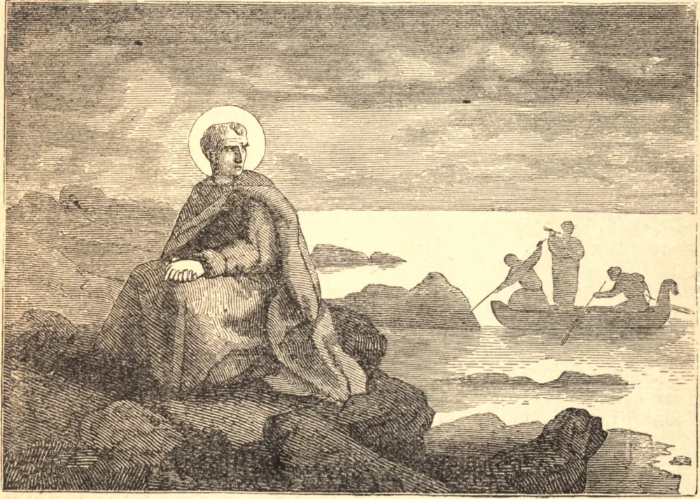

# 20 de junho — SÃO SILVÉRIO, Papa e Mártir

SILVÉRIO era filho do Papa Hormisdas, que fora casado antes de entrar no ministério. Por ocasião da morte de São Agapito, depois de uma vacância de quarenta e sete dias, Silvério, então subdiácono, foi escolhido Papa, e ordenado no dia 8 de junho de 536.

Teodora, a imperatriz de Justiniano, resolveu promover a seita dos acéfalos. Esforçou-se por atrair Silvério aos seus interesses, e escreveu-lhe, ordenando que reconhecesse Antimo como bispo legítimo, ou que se dirigisse em pessoa a Constantinopla e reexaminasse a sua causa no próprio lugar. Sem a menor hesitação ou demora, Silvério devolveu-lhe uma breve resposta, pela qual peremptoriamente lhe deu a entender que nem podia nem queria obedecer às suas exigências injustas e trair a causa da fé católica. A imperatriz, vendo que nada podia esperar dele, resolveu fazê-lo deposto.

Vigílio, arcediago da Igreja Romana, homem de manhas, encontrava-se então em Constantinopla. A ele a imperatriz fez o seu apelo, e, encontrando-o tomado pela isca da ambição, prometeu fazê-lo Papa, e conceder-lhe setecentas peças de ouro, contanto que se comprometesse a condenar o Concílio de Calcedônia e a receber à Comunhão os três patriarcas eutiquianos depostos, Antimo de Constantinopla, Severo de Antioquia e Teodósio de Alexandria. Tendo o infeliz Vigílio assentido a essas condições, a imperatriz o enviou a Roma, encarregado de uma carta ao general Belisário, ordenando-lhe que expulsasse Silvério e que arquitetasse a eleição de Vigílio ao pontificado. Vigílio instou o general a executar o projeto.

Para mais facilmente levar a cabo este projeto, o Papa foi acusado de manter correspondência com o inimigo, e produziu-se uma carta que se pretendia haver sido escrita por ele ao rei dos godos, convidando-o à cidade e prometendo abrir-lhe as portas. Silvério foi banido para Patara, na Lícia. O bispo daquela cidade recebeu o ilustre exilado com todas as marcas possíveis de honra e respeito; e, julgando-se obrigado a empreender a sua defesa, dirigiu-se a Constantinopla, e falou ousadamente ao imperador, aterrorizando-o com as ameaças dos juízos divinos pela expulsão de um bispo de tão grande sé, dizendo-lhe: "Há muitos reis no mundo, mas há apenas um Papa sobre a Igreja do mundo inteiro." Há de se observar que estas eram as palavras de um bispo oriental, e uma clara confissão da supremacia da Sé Romana.

Justiniano pareceu assustado com a atrocidade dos procedimentos, e deu ordens para que Silvério fosse reenviado a Roma, mas os inimigos do Papa arquitetaram impedi-lo, e ele foi interceptado em seu caminho rumo a Roma e levado a uma ilha deserta, onde morreu no dia 20 de junho de 538.
