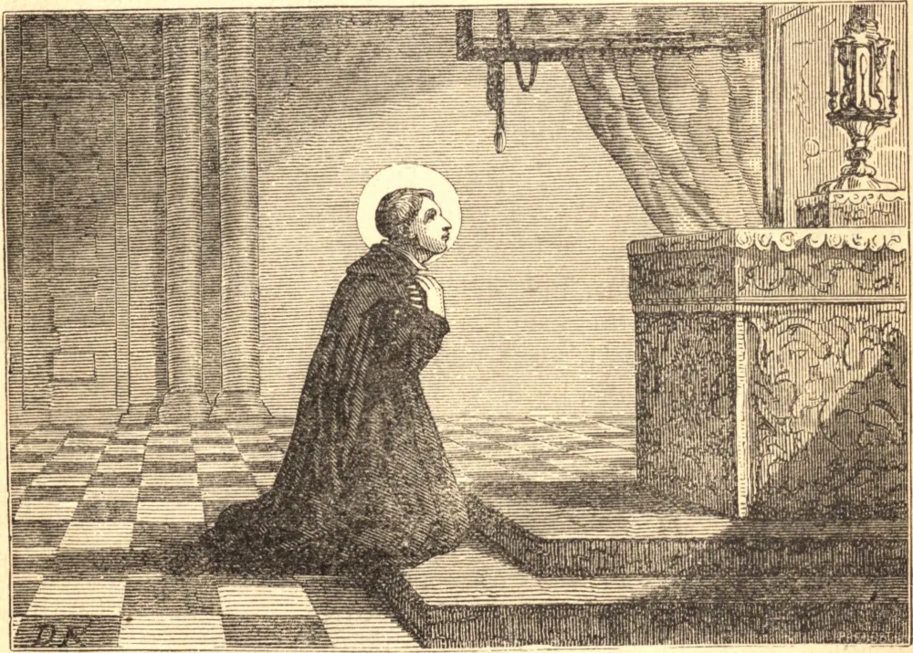

# 21 de junho — SÃO LUÍS GONZAGA

LUÍS, o filho mais velho de Fernando Gonzaga, Marquês de Castiglione, nasceu no dia 9 de março de 1568. As primeiras palavras que pronunciou foram os santos nomes de Jesus e de Maria. Quando tinha nove anos de idade, fez voto de virgindade perpétua, e por uma graça especial foi sempre isento de tentações contra a pureza. Recebeu a sua primeira Comunhão das mãos de São Carlos Borromeu. Em tenra idade resolveu deixar o mundo, e numa visão foi conduzido por Nossa Senhora a entrar na Companhia de Jesus. A mãe do Santo regozijou-se ao saber da sua determinação de tornar-se religioso, mas seu pai durante três anos recusou o seu consentimento.

Por fim, São Luís obteve permissão para entrar no noviciado no dia 25 de novembro de 1585. Fez os seus votos depois de dois anos, e passou pelo curso ordinário de filosofia e teologia. Costumava dizer que duvidava se, sem penitência, a graça continuaria a fazer frente à natureza, a qual, quando não afligida e castigada, tende gradualmente a recair no seu antigo estado, perdendo o hábito de sofrer adquirido pelo labor de anos. "Sou um pedaço de ferro torto", dizia ele, "e vim para a religião a fim de ser endireitado pelo martelo da mortificação e da penitência."

Durante o seu último ano de teologia, irrompeu em Roma uma febre maligna; o Santo ofereceu-se para o serviço dos enfermos, e foi aceito para o perigoso encargo. Vários dos irmãos contraíram a febre, e Luís foi um deles. Foi levado às portas da morte, mas recuperou-se, apenas para cair, contudo, numa febre lenta, que o levou ao fim depois de três meses. Morreu, repetindo o Santo Nome, um pouco depois da meia-noite entre os dias 20 e 21 de junho, na oitava do Corpus Christi, tendo pouco mais de vinte e três anos de idade.

**Reflexão**—O Cardeal Belarmino, confessor do Santo, testemunhou que ele jamais ofendera mortalmente a Deus. Contudo, castigava o corpo rigorosamente, levantava-se de noite para orar, e derramava muitas lágrimas pelos seus pecados. Ora para que, não tendo seguido a sua inocência, possas ao menos imitar a sua penitência.
