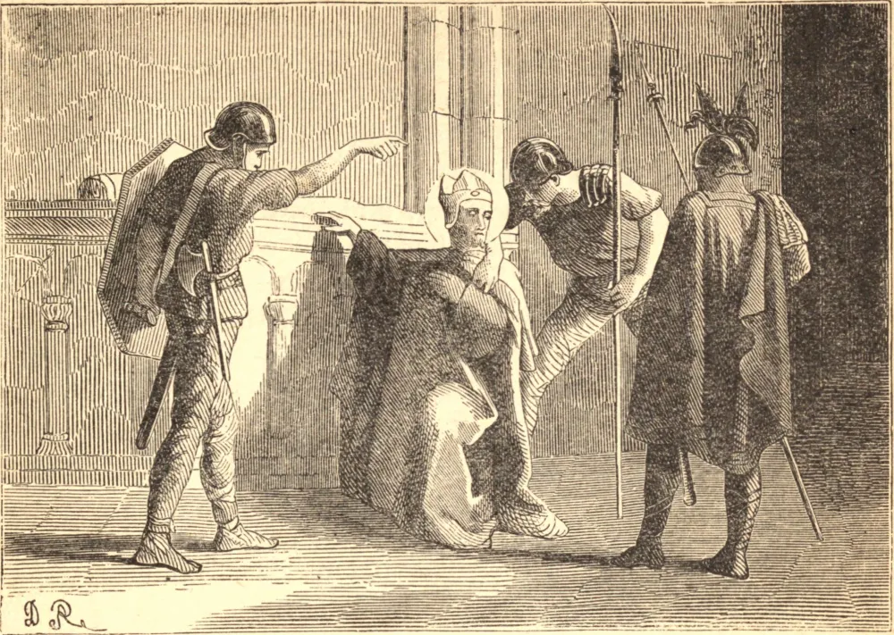

# 22 de junho — SÃO PAULINO DE NOLA

PAULINO era de uma família que se gloriava de uma longa linhagem de senadores, prefeitos e cônsules. Foi educado com grande cuidado, e o seu gênio e a sua eloquência, em prosa e em verso, eram a admiração de São Jerônimo e de Santo Agostinho. Mais que duplicara a sua riqueza pelo casamento, e era um dos homens mais eminentes do seu tempo. Embora fosse o amigo escolhido de Santos, e tivesse grande devoção a São Félix de Nola, era ainda apenas um catecúmeno, tentando servir a dois senhores. Mas Deus o atraiu a Si pelo caminho das dores e das provações. Recebeu o batismo, retirou-se à Espanha para ficar a sós, e então, de comum acordo com a sua santa esposa, vendeu todas as suas vastas propriedades em diversas partes do império, distribuindo o seu produto tão prudentemente que São Jerônimo diz que o Oriente e o Ocidente ficaram cheios das suas esmolas. Foi então ordenado sacerdote, e retirou-se a Nola, na Campânia. Ali reconstruiu a Igreja de São Félix com grande magnificência, e a serviu noite e dia, vivendo uma vida de extrema abstinência e labor. Em 409 foi escolhido bispo, e por mais de trinta anos governou de tal modo que se tornou notável numa época abençoada com muitos bispos grandes e sábios. São Gregório Magno nos conta que, quando os vândalos da África fizeram uma incursão na Campânia, Paulino gastou tudo o que tinha em socorrer a aflição do seu povo e em resgatá-los da escravidão. Por fim veio uma pobre viúva; o seu único filho fora levado pelo genro do rei vândalo. "O que tenho eu te dou", disse-lhe o Santo; "iremos à África, e eu me darei em lugar do teu filho." Tendo vencido a resistência dela, partiram, e Paulino foi aceito em lugar do filho da viúva, e empregado como jardineiro. Depois de algum tempo, o rei descobriu, por intervenção divina, que o escravo do seu genro era o grande Bispo de Nola. Imediatamente o pôs em liberdade, concedendo-lhe também a liberdade de todos os habitantes de Nola que se achavam na escravidão. Alguém que bem o conhecia diz que ele era manso como Moisés, sacerdotal como Aarão, inocente como Samuel, terno como Davi, sábio como Salomão, apostólico como Pedro, amoroso como João, cauteloso como Tomé, perspicaz como Estêvão, fervoroso como Apolo. Morreu em 431.

## Reflexão

"Vai à Campânia", escreve Santo Agostinho; "ali estuda Paulino, aquele eleito servo de Deus. Com que generosidade, com que humildade ainda maior, lançou de si o fardo das grandezas deste mundo para tomar sobre si o jugo de Cristo, e no serviço d'Ele quão serena e discreta a sua vida!"
