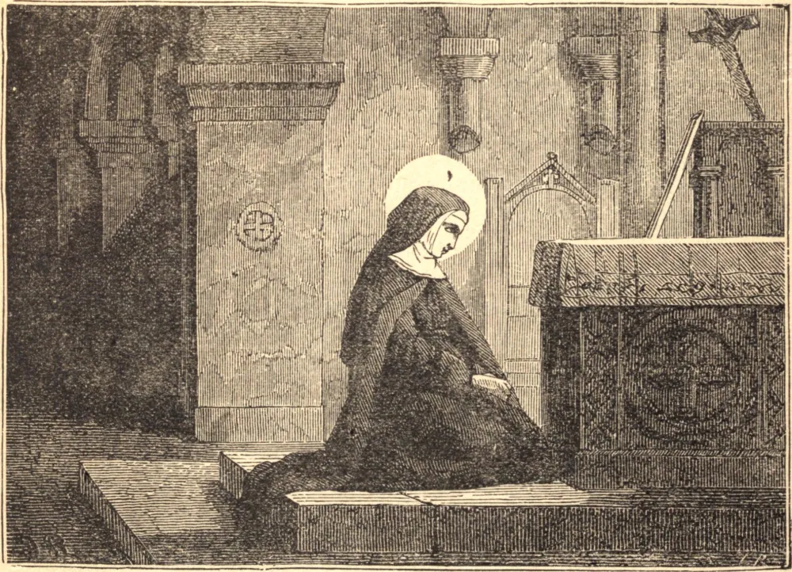

# 23 de junho — SANTA ETELDREDA, Abadessa

NASCIDA e criada no temor de Deus — sua mãe e três irmãs são contadas entre os Santos — Eteldreda tinha um único objetivo na vida: dedicar-se ao Seu serviço no estado religioso. Seus pais, contudo, tinham outras pretensões para ela, e, apesar das suas lágrimas e orações, foi obrigada a tornar-se esposa de Tonberto, um tributário do rei dos mércios. Viveu com ele como virgem por três anos, e, à morte dele, retirou-se à ilha de Ely, para que pudesse aplicar-se inteiramente às coisas celestiais.

Esta felicidade foi, porém, de curta duração; pois Egfrido, o poderoso Rei da Nortúmbria, insistiu no seu pretendimento sobre ela com tamanha veemência que ela foi forçada a um segundo casamento. A sua vida na corte dele era a de uma asceta antes que a de uma rainha: vivia com ele não como esposa, mas como irmã, e, observando uma escrupulosa regularidade de disciplina, dedicava o seu tempo a obras de misericórdia e de amor.

Depois de doze anos, retirou-se, com o consentimento do marido, à Abadia de Coldingham, que estava então sob a regra de Santa Ebba, e recebeu o véu das mãos de São Wilfrido. Tão logo Eteldreda deixou a corte do marido, ele se arrependeu de haver consentido na sua partida, e a seguiu, tencionando trazê-la de volta à força. Ela refugiou-se num promontório na costa perto de Coldingham; e aqui sucedeu um milagre, pois as águas abriram para si uma passagem ao redor do monte, impedindo o avanço ulterior de Egfrido. A Santa permaneceu neste refúgio insular por sete dias, até que o rei, reconhecendo a vontade divina, concordou em deixá-la em paz. Deus, que por um milagre confirmou a vocação da Santa, não nos faltará se, com um coração indiviso, O escolhermos.

Em 672 ela voltou a Ely, e fundou ali um mosteiro duplo. O convento de freiras ela mesma governava, e era pelo seu exemplo uma regra viva de perfeição para as suas irmãs. Algum tempo depois da sua morte, em 679, o seu corpo foi achado incorrupto, e São Beda registra muitos milagres operados pelas suas relíquias.

**Reflexão**—A alma não pode verdadeiramente servir a Deus enquanto está envolvida nas distrações e nos prazeres do mundo. Eteldreda sabia disto, e preferiu ser serva de Cristo seu Senhor a ser senhora de uma corte terrena. Resolve, em qualquer estado em que te encontres, viver absolutamente desapegado do mundo, e separar-te dele tanto quanto possível.
