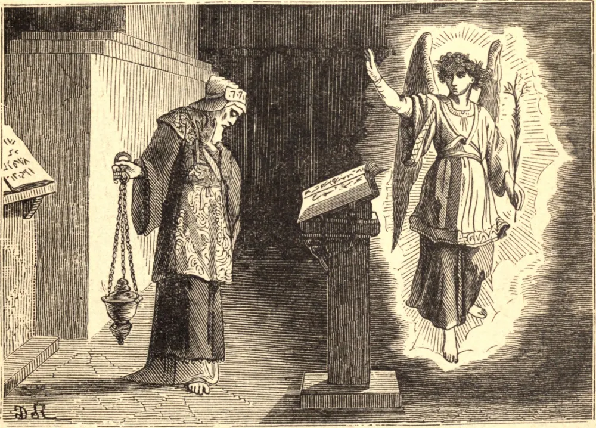

# 24 de junho — SÃO JOÃO BATISTA

O nascimento de São João foi predito por um anjo do Senhor a seu pai, Zacarias, que oferecia incenso no Templo. Era o ofício de São João preparar o caminho para Cristo, e antes de nascer ao mundo já começou a viver para o Deus Encarnado. Mesmo no ventre conheceu a presença de Jesus e de Maria, e exultou de alegria à feliz vinda do Filho do homem. Na sua juventude permaneceu oculto, porque Aquele a quem ele aguardava estava também oculto. Mas antes que a vida pública de Cristo começasse, um impulso divino conduziu São João ao deserto; ali, com gafanhotos por alimento e cilício sobre a pele, em silêncio e em oração, castigou a sua própria alma. Então, à medida que multidões irromperam na sua solidão, ele as advertiu a fugir da ira vindoura, e deu-lhes o batismo de penitência, enquanto elas confessavam os seus pecados. Por fim ergueu-se na multidão Um a quem São João não conhecia, até que uma voz interior lhe disse que era o seu Senhor. Com o batismo de São João, Cristo começou a Sua penitência pelos pecados do Seu povo, e São João viu o Espírito Santo descer em forma corpórea sobre Ele. Então a obra do Santo estava cumprida. Restava-lhe apenas apontar os seus próprios discípulos para o Cordeiro, restava-lhe apenas diminuir à medida que Cristo crescia. Viu todos os homens deixá-lo e ir após Cristo. "Eu vos disse", afirmou ele, "que não sou o Cristo. O amigo do Esposo regozija-se com a voz do Esposo. Esta minha alegria, pois, está completa." São João fora lançado na fortaleza de Maqueronte por um tirano indigno cujos crimes ele havia repreendido, e ali havia de permanecer até ser decapitado, à vontade de uma jovem que dançou diante deste miserável rei. Neste tempo de desespero, se São João pudesse ter conhecido o desespero, alguns dos seus antigos discípulos o visitaram. São João não lhes falou de si mesmo, mas os enviou a Cristo, para que vissem as provas da Sua missão. Então a Verdade Eterna pronunciou o panegírico do Santo que vivera e respirara somente para Ele: "Em verdade vos digo: Entre os nascidos de mulher não surgiu maior do que João Batista."

## Reflexão

São João foi grande diante de Deus porque se esqueceu de si mesmo e viveu para Jesus Cristo, que é a fonte de toda grandeza. Lembra-te de que nada és; a tua própria vontade e os teus próprios desejos só podem conduzir à miséria e ao pecado. Sacrifica, pois, cada dia alguma de tuas inclinações naturais ao Sagrado Coração de Nosso Senhor, e aprende pouco a pouco a perder-te n'Ele.
