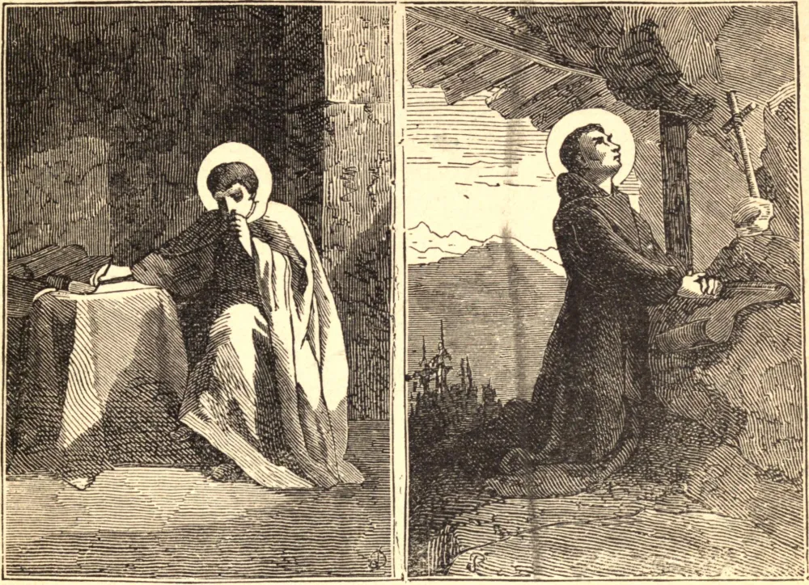

# 25 de junho — SÃO PRÓSPERO DA AQUITÂNIA — SÃO GUILHERME DE MONTE-VERGINE

SÃO PRÓSPERO nasceu na Aquitânia, no ano de 403. As suas obras mostram que na sua juventude se aplicara felizmente a todos os ramos do saber, tanto profano quanto sagrado. Por causa da pureza e da santidade dos seus costumes, é chamado pelos da sua época de homem santo e venerável. O nosso Santo não parece ter sido mais que um leigo; mas, sendo de grande virtude e de talentos e erudição extraordinários, escreveu várias obras nas quais refutou habilmente os erros da heresia. São Leão Magno, ao ser escolhido Papa em 440, convidou São Próspero a Roma, fê-lo seu secretário, e o empregou nos mais importantes negócios da Igreja. O nosso Santo esmagou a heresia pelagiana, que começava de novo a erguer a cabeça naquela capital, e a sua derrota final atribui-se ao seu zelo, à sua erudição e aos seus incansáveis esforços. A data da sua morte é incerta, mas ele ainda vivia em 463.

SÃO GUILHERME, havendo perdido o pai e a mãe na sua infância, foi criado pelos seus amigos em grandes sentimentos de piedade; e aos quinze anos de idade, por um ardente desejo de levar uma vida penitencial, deixou o Piemonte, a sua terra natal, fez uma austera peregrinação a Santiago, na Galiza, e depois retirou-se ao reino de Nápoles, onde escolheu para sua morada uma montanha deserta, e viveu em perpétua contemplação e nos exercícios das mais rigorosas austeridades penitenciais. Vendo-se descoberto e interrompida a sua contemplação, mudou de habitação e estabeleceu-se num lugar chamado Monte-Vergine, situado entre Nola e Benevento, no mesmo reino; mas a sua reputação o seguiu, e foi obrigado por dois sacerdotes vizinhos a permitir que certas pessoas fervorosas vivessem com ele e imitassem as suas práticas ascéticas. Assim, em 1119, foi lançado o fundamento da congregação religiosa chamada *de Monte-Vergine*. O Santo morreu no dia 25 de junho de 1142.
