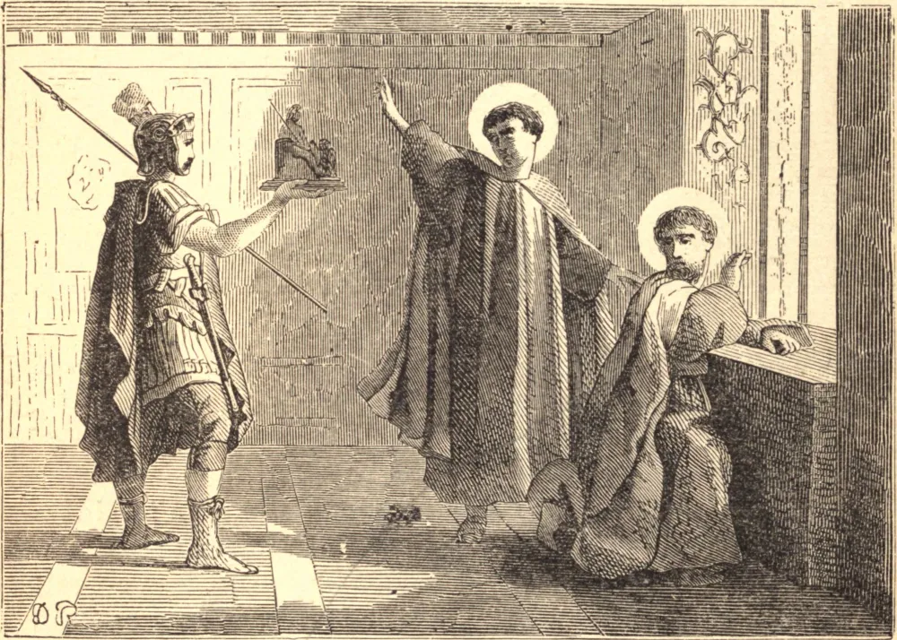

# 26 de junho — SÃO JOÃO E SÃO PAULO, Mártires

ESTES dois Santos eram ambos oficiais do exército sob Juliano, o Apóstata, e receberam a coroa do martírio, provavelmente em 362. Glorificaram a Deus por uma dupla vitória; desprezaram as honras do mundo, e triunfaram sobre as suas ameaças e os seus tormentos. Viram muitos homens ímpios prosperar na sua impiedade, mas não se deixaram deslumbrar pelo seu exemplo. Consideravam que a prosperidade mundana que acompanha a impunidade no pecado é o mais terrível de todos os juízos; e quão falsa e efêmera era esta reluzente prosperidade de Juliano, que num instante caiu no fosso que ele mesmo cavara!

Mas os mártires, pelo labor momentâneo do seu combate, adquiriram um imenso peso de glória que jamais fenece; os seus tormentos foram, pela sua heroica paciência e pela sua invencível virtude e fidelidade, um espetáculo digno de Deus, que do alto do trono da Sua glória os contemplava, e mantinha o Seu braço estendido para fortalecê-los, e para pôr sobre as suas cabeças coroas imortais no feliz momento da sua vitória.

**Reflexão**—Os Santos sempre julgaram que nada haviam feito por Cristo enquanto não tivessem resistido até ao sangue, e, derramando a última gota, completado o seu sacrifício. Cada ação da nossa vida deveria brotar deste fervoroso motivo, e deveríamos consagrar-nos ao serviço divino com todas as nossas forças; devemos sempre ter em mente que devemos a Deus tudo o que somos, e que, depois de tudo o que possamos fazer, somos servos inúteis, e fazemos apenas aquilo que estamos obrigados a fazer.
