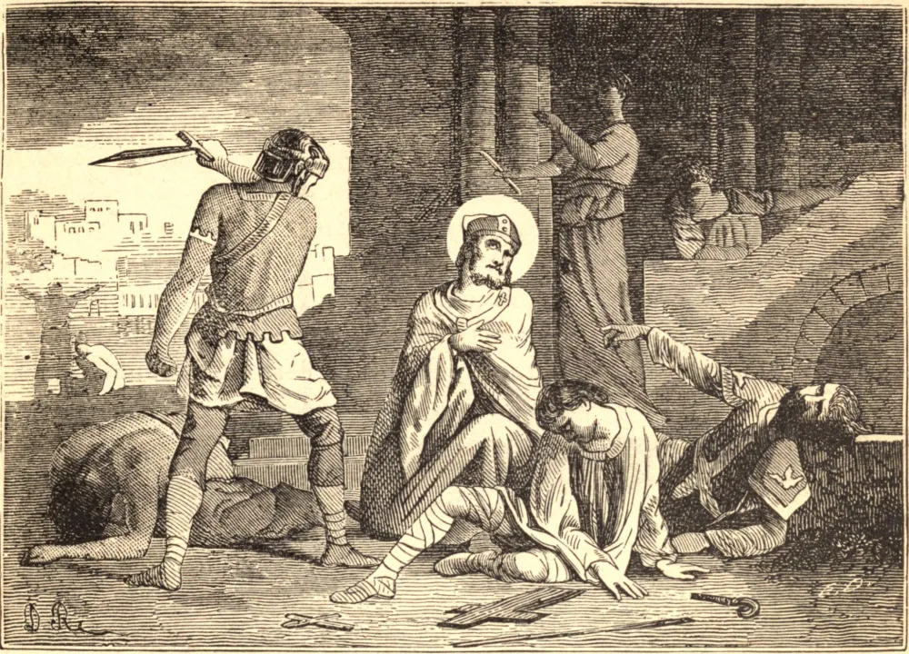

# 28 de junho — SANTO IRINEU, Bispo, Mártir

ESTE Santo nasceu por volta do ano 120. Era grego, provavelmente natural da Ásia Menor. Seus pais, que eram cristãos, o colocaram sob os cuidados do grande São Policarpo, Bispo de Esmirna. Foi em tão santa escola que ele aprendeu aquela ciência sagrada que o tornou depois um grande ornamento da Igreja e o terror dos seus inimigos.

São Policarpo cultivou o seu gênio nascente, e formou o seu espírito na piedade por preceitos e exemplos; e o zeloso discípulo foi cuidadoso em colher todas as vantagens que lhe eram oferecidas pela felicidade de tal mestre. Tamanha era a sua veneração pela santidade do seu tutor que observava cada ação e tudo quanto via naquele homem santo, para melhor copiar o seu exemplo e aprender o seu espírito. Escutava as suas instruções com um ardor insaciável, e tão profundamente as gravou no seu coração que as impressões permaneceram vivíssimas até à sua velhice. A fim de refutar as heresias da sua época, este padre familiarizou-se com as mais absurdas fantasias dos seus filósofos, meio pelo qual ficou habilitado a remontar cada erro às suas fontes e a expô-lo em plena luz.

São Policarpo enviou Santo Irineu à Gália, em companhia de algum sacerdote; ele mesmo foi ordenado sacerdote da Igreja de Lião por São Potino. Tendo São Potino glorificado a Deus pela sua feliz morte, no ano de 177, o nosso Santo foi escolhido segundo Bispo de Lião. Pela sua pregação, em pouco tempo converteu quase todo aquele país à Fé. Escreveu várias obras contra a heresia, e por fim, com muitos outros, sofreu o martírio por volta do ano 202, sob o Imperador Severo, em Lião.

**Reflexão**—Pais e mães, e chefes de família, espirituais e temporais, devem ter em mente que os inferiores "não serão corrigidos apenas por palavras", mas que o exemplo também é necessário.
