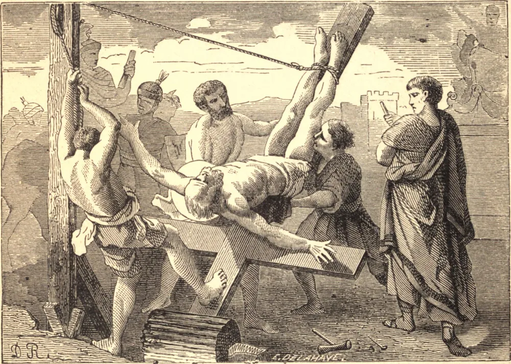

# 29 de junho — SÃO PEDRO, Apóstolo

PEDRO era de Betsaida, na Galileia, e, enquanto pescava no lago, foi chamado por Nosso Senhor a ser um dos Seus apóstolos. Era pobre e iletrado, mas cândido, ardente e amoroso. No seu coração, antes de tudo, cresceu a convicção, e dos seus lábios saiu a confissão: "Tu és o Cristo, o Filho do Deus vivo;" e assim Nosso Senhor o escolheu, e o capacitou a ser a Rocha da Sua Igreja, o Seu Vigário na terra, a cabeça e o príncipe dos Seus apóstolos, o centro e o próprio princípio da unidade da Igreja, a fonte de todos os poderes espirituais, e o mestre infalível da Sua verdade.

Toda a Escritura está viva com ele; mas depois de Pentecostes ele se destaca em toda a grandeza do seu ofício. Ocupa o trono apostólico vago; admite os judeus aos milhares no aprisco; abre-o aos gentios na pessoa de Cornélio; funda, e por um tempo governa, a Igreja de Antioquia, e envia Marcos a fundar a de Alexandria. Dez anos depois da Ascensão foi a Roma, o centro do majestoso Império Romano, onde se achavam reunidas as glórias e as riquezas da terra e todos os poderes do mal. Ali estabeleceu a sua Cátedra, e por vinte e cinco anos labutou com São Paulo na edificação da grande Igreja Romana. Foi crucificado por ordem de Nero, e sepultado no Monte Vaticano. Escreveu duas Epístolas, e sugeriu e aprovou o Evangelho de São Marcos.

Duzentos e sessenta anos depois do martírio de São Pedro veio o triunfo manifesto da Igreja. O Papa São Silvestre, com os bispos, o clero e todo o corpo dos fiéis, percorreu Roma em procissão até o Monte Vaticano, cantando os louvores de Deus até que as sete colinas ressoassem de novo. O primeiro imperador cristão, depondo o seu diadema e as suas vestes de estado, começou a cavar os fundamentos da Igreja de São Pedro. E agora, no sítio daquela velha igreja, ergue-se o mais nobre templo jamais levantado pelo homem; sob um imponente baldaquino jazem os grandes apóstolos, na morte, como na vida, indivisíveis; e ali está a Cátedra de São Pedro. Em torno repousam os mártires de Cristo — Papas, Santos, Doutores, do oriente e do ocidente — e bem acima de tudo, as palavras: "Tu és Pedro, e sobre esta Rocha edificarei a Minha Igreja." É o limiar dos apóstolos e o centro do mundo.

**Reflexão**—Pedro ainda vive nos seus sucessores, e governa e apascenta o rebanho que lhe foi confiado. A realidade da nossa devoção a ele é a prova mais segura da pureza da nossa fé.
