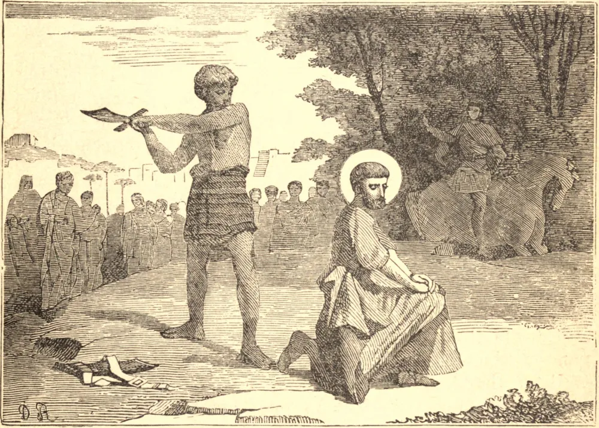

# 30 de junho — SÃO PAULO

SÃO PAULO nasceu em Tarso, de pais judeus, e estudou em Jerusalém, aos pés de Gamaliel. Ainda jovem, guardou as vestes daqueles que apedrejaram o protomártir Estêvão; e no seu inquieto zelo avançou rumo a Damasco, "respirando ameaças e mortandade contra os discípulos de Cristo." Mas perto de Damasco uma luz do céu o derrubou por terra. Ouviu uma voz que dizia: "Por que Me persegues?" Viu a forma d'Aquele que fora crucificado pelos seus pecados, e então por três dias nada mais viu. Despertou do seu transe outro homem — uma nova criatura em Jesus Cristo. Deixou Damasco para um longo retiro na Arábia, e então, ao chamado de Deus, levou o Evangelho até aos confins extremos do mundo, e por anos viveu e labutou sem outro pensamento senão o pensamento de Cristo crucificado, sem outro desejo senão o de gastar-se e consumir-se por Ele. Tornou-se o apóstolo dos gentios, a quem fora ensinado a odiar, e desejava-se a si mesmo anátema pelos seus próprios compatriotas, que buscavam a sua vida. Perigos por terra e por mar não puderam abater a sua coragem, nem o labor, o sofrimento e a idade embotar a ternura do seu coração. Por fim, deu sangue por sangue. Na sua juventude embebera-se do falso zelo dos fariseus em Jerusalém, a cidade santa da antiga dispensação. Com São Pedro consagrou Roma, a nossa cidade santa, pelo seu martírio, e derramou na sua Igreja toda a sua doutrina com todo o seu sangue. Deixou quatorze Epístolas, que têm sido uma fonte primeira da doutrina da Igreja, a consolação e o deleite dos seus maiores Santos. A sua vida interior, tanto quanto as palavras o podem dizer, abre-se diante de nós nestes escritos divinos, a vida de quem morreu para sempre para si mesmo e ressuscitou em Jesus Cristo. "Em que", diz São Crisóstomo, "em que levou este bem-aventurado vantagem sobre os outros apóstolos? Como vem a ser que ele vive na boca de todos os homens por todo o mundo? Não é pela virtude das suas Epístolas?" Nem cessará a sua obra enquanto durar a raça humana. Ainda agora, como o mais cavalheiresco dos cavaleiros, está em nosso meio, e cativa todo pensamento à obediência de Cristo.

## Reflexão

São Paulo lamenta que todos buscam as coisas que são suas, e não as coisas que são de Cristo. Vê se estas palavras se aplicam a ti, e resolve dar-te sem reservas a Deus.
