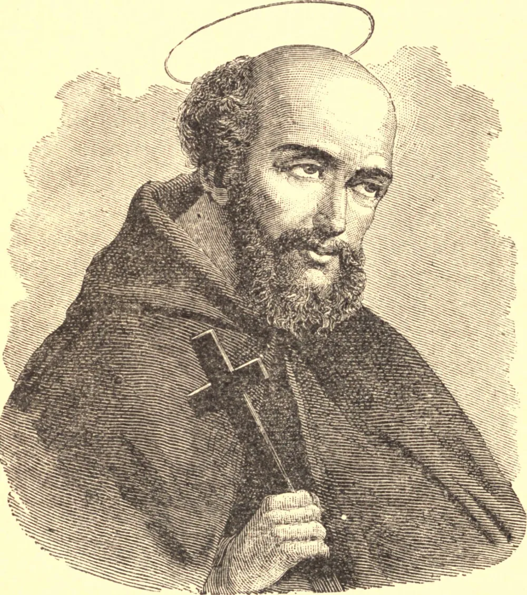

# São Lourenço de Brindisi

Este Santo nasceu em 22 de julho de 1559, e desde tenra idade mostrou inclinação para a vida monástica. Para a estimular, seus piedosos pais colocaram-no no convento franciscano de Brindisi. Tendo ficado órfão ainda muito jovem, foi a Veneza, onde seu tio, homem de grande saber e muito interessado em nosso Santo, era Superior do Colégio de São Marcos. Quando ainda não tinha dezesseis anos, Lourenço foi atraído pelos capuchinhos, então em seu primeiro fervor, e em 18 de fevereiro de 1575 entrou para aquela Ordem. Aplicando-se diligentemente ao estudo, tornou-se um consumado conhecedor do hebraico. Ao término de sua carreira escolástica foi ordenado sacerdote. Foi tão grande a messe de almas obtida por sua pregação que o Papa Clemente VIII chamou-o a Roma para trabalhar pela conversão dos judeus. Seu conhecimento do texto hebraico dos livros sagrados foi-lhe de grande auxílio em seu trabalho; as conversões deram-se em número inesperado, e assim continuaram a aumentar, de modo que logo o nome do Beato Lourenço tornou-se palavra corrente por toda a Itália. Visitou quase todas as cidades importantes da Itália, ganhando almas para Deus por toda parte, e prosseguiu nesta jornada missionária até ser chamado a ocupar a Cátedra de Teologia. Posteriormente foi posto à frente do Convento do Santo Redentor em Veneza, e depois feito Superior da casa de Bassano. Em ambos esses cargos mostrou tão grande capacidade administrativa que, em 1590, com apenas trinta anos de idade, foi escolhido Provincial da Toscana. Três anos depois foi eleito Provincial de Veneza e retornou àquela cidade. Estando em uma parte remota da província, fazendo sua visita provincial, soube que seu tio, que o havia amparado quando criança órfã, agonizava em Veneza, e, apesar das muitas dificuldades da jornada, apressou-se a regressar ao leito do bom ancião, e ali permaneceu até a morte deste, quando o Santo retomou suas visitas provinciais.

Em 1596 Lourenço foi nomeado Definidor Geral, e estava prestes a fazer uma visitação das casas capuchinhas por toda a Sicília quando o Papa Clemente VIII, a pedido do Imperador Rodolfo II, ordenou-lhe que fosse à Alemanha, para ali fundar casas de sua Ordem, na esperança de conter a maré de heresia que então inundava aquele reino. Nisto, como em suas demais boas obras, Lourenço foi eminentemente bem-sucedido, e em menos de um ano havia fundado casas em Viena, Praga e Graz.

Por essa época os turcos, sob Maomé III, ansiosos por vingar sua derrota em Lepanto, ameaçavam invadir e conquistar a Hungria, e parecia que nenhum poder os deteria. A Alemanha, tristemente perturbada pela Reforma, dilacerada por rixas e guerras civis, era incapaz de resistir sozinha. Nessa conjuntura, nosso Santo apelou às cortes católicas e protestantes, e logo um exército de trinta mil homens estava em campo, pronto a enfrentar os invasores infiéis. Em outubro de 1601, os turcos, em número de oitenta a noventa mil homens, atravessaram o Danúbio e enfrentaram o exército cristão, que se decidiu não ousar arriscar um combate. Mas Lourenço de tal modo inflamou os corações dos soldados que estes ansiavam pela batalha. Cruz na mão, o santo monge avançou à frente do pequeno exército, e, embora tão amplamente em inferioridade numérica, antes do anoitecer a vitória pousou sobre seus estandartes. Três dias depois travou-se outra batalha com resultado semelhante, e os turcos derrotados reatravessaram o Danúbio com a perda de trinta mil homens. A certa altura, durante a segunda batalha, nosso Santo foi levado ao mais denso da peleja, e logo se viu cercado pelos infiéis. Foi, porém, resgatado por dois oficiais, que o repreenderam por sua temeridade e lhe suplicaram que fosse para a retaguarda, alegando que a linha de frente não era lugar para ele. "Meu lugar é aqui", foi sua resposta, "e aqui hei de ficar." E ficou, até que a sorte do dia se decidiu em favor dos cristãos.

Terminado seu serviço militar, Lourenço regressou à Itália, viajando, em geral, a pé e sem se dar a conhecer. Visitou Loreto, servindo humildemente em uma Missa celebrada na Santa Casa. Quando chegou a Páscoa, foi a Roma e assistiu ao Capítulo Geral ali realizado; e quando se procedeu à eleição para Geral, descobriu, para seu grande desalento, que, embora não tivesse cinquenta e três anos de idade, fora eleito Geral dos capuchinhos, o mais alto ofício de sua Ordem. Pôs-se de imediato em suas visitas oficiais, percorrendo a Suíça, Flandres, França, Espanha e Alemanha. Regressou à Itália em 1605, e havia chegado a Nápoles quando recebeu a notícia da morte do Papa Clemente VIII. Como seu mandato expirava naquele ano, Lourenço esperava descansar por algum tempo; mas não haveria descanso para ele deste lado do túmulo, e foi às pressas reenviado à Alemanha, então em um tumulto de agitação.

A União Protestante, que surgira da espinhosa questão do ducado de Cleves, fortaleceu-se por uma aliança com Henrique IV da França, e os católicos viram necessário unir-se para a própria proteção. Com o consentimento do Papa Paulo V, nosso Santo apelou pessoalmente a Filipe III da Espanha e à sua Rainha, Margarida, que o receberam com grande favor e enviaram reforços a Maximiliano, Duque da Baviera, então à frente da "Santa Liga", ou partido católico. Daí resultou a paz, e atribui-se ao Duque Maximiliano ter dito que "toda a Alemanha e toda a cristandade devem uma dívida de gratidão imorredoura ao Padre da Brindisi, pois sem ele nenhuma Liga se teria mantido unida."

No Capítulo Geral de 1613 Lourenço foi nomeado Definidor Geral, e pouco depois foi enviado como Visitador à Província de Gênova. Ao chegar a Pavia, convocou o Capítulo Provincial, cujo primeiro ato foi elegê-lo Provincial. Esforçou-se por declinar, mas Roma decidiu que devia aceitar. Seguiu-se uma série ininterrupta de labores. Era procurado por toda parte, tanto por príncipes quanto pelo povo. Pode-se fazer alguma ideia do amor que se sentia por nosso Santo a partir do que sucedeu em sua última visita a Milão. Foi obrigado, a frequentes intervalos, a subir ao púlpito e dar sua bênção às vastas multidões que vinham de perto e de longe para ouvi-lo e vê-lo, e quando deixou a cidade o povo aglomerou-se ao seu redor, chorando e clamando por mais uma bênção, até que por fim foi obrigado a voltar atrás; subindo ao degrau mais alto diante da igreja, tirou do pescoço a cruz que sempre trazia e com ela os abençoou. "Abençoai o pastor tanto quanto o seu rebanho", exclamou o Arcebispo, o Cardeal Borromeu, irmão de São Carlos; e, ajoelhando-se humildemente com o povo, também ele recebeu a bênção de nosso Santo.

O Capítulo Geral, realizado em 1.º de junho de 1618, deu a Lourenço permissão para visitar Brindisi, sua terra natal, que não via desde a infância. A caminho, deteve-se em Nápoles, e, ao insistente pedido do Cardeal e dos mais altos homens do lugar, empreendeu uma missão junto ao Rei Filipe, que então se encontrava em Lisboa. Mal havia chegado àquele lugar quando adoeceu; e em 22 de julho de 1619 sua atarefada vida chegou ao fim, e ele pôde gozar do descanso por que tanto ansiara. Suas penitências, suas virtudes e seus milagres fazem agora parte da história da Igreja pela qual por tanto tempo e com tanto êxito trabalhou.
