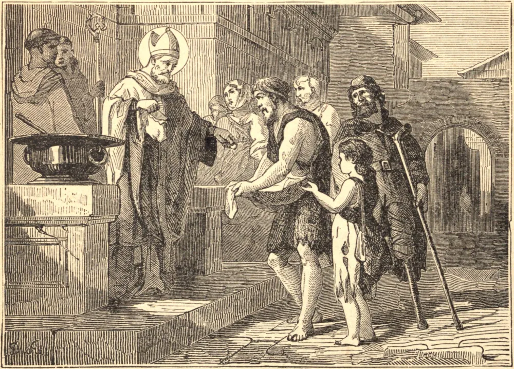

# SANTO ALBINO, Bispo

SANTO ALBINO era de uma antiga e nobre família na Bretanha, e desde a infância foi fervoroso em todo exercício de piedade. Suspirava ardentemente pela felicidade que uma alma devota encontra em estar perfeitamente desprendida de todas as coisas terrenas. Havendo abraçado o estado monástico em Tintillant, perto de Angers, brilhou como um perfeito modelo de virtude, vivendo como se em todas as coisas estivesse sem qualquer vontade própria; e sua alma parecia tão perfeitamente governada pelo espírito de Cristo que vivia somente para Ele. Aos trinta e cinco anos de idade foi escolhido abade, em 504, e vinte e cinco anos depois Bispo de Angers. Por toda parte restaurou a disciplina, estando inflamado por um santo zelo pela honra de Deus. Sua dignidade não pareceu fazer alteração alguma nem em suas mortificações nem no constante recolhimento de sua alma. Honrado por todo o mundo, mesmo por reis, jamais foi afetado pela vaidade. Poderoso em obras e milagres, considerava-se o mais indigno e o mais inútil entre os servos de Deus, e não tinha outra ambição senão parecer aos olhos dos outros tal como era aos olhos de sua própria humildade. No terceiro Concílio de Orleans, em 538, conseguiu que fosse revivido o trigésimo cânon do Concílio de Épao, pelo qual são declarados excomungados aqueles que ousam contrair matrimônios incestuosos no primeiro ou segundo grau de consanguinidade ou afinidade. Morreu no dia 1 de março, em 549.

## Reflexão

Com quaisquer virtudes que um homem possa estar dotado, ele descobrirá, se se considerar atentamente, profundidade suficiente de miséria para fornecer causa de profunda humildade; mas Jesus Cristo diz: "Aquele que se humilha será exaltado."
