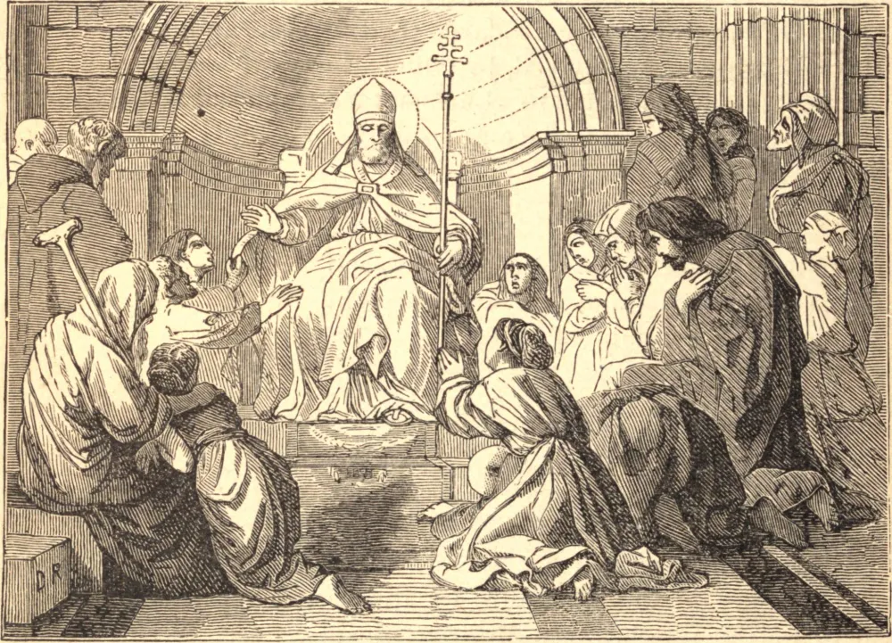

# 2 de março — SÃO SIMPLÍCIO, Papa

SÃO SIMPLÍCIO foi o ornamento do clero romano sob São Leão e São Hilário, e sucedeu a este último no pontificado em 468. Foi suscitado por Deus para consolar e sustentar a sua Igreja em meio às maiores tempestades. Todas as províncias do Império do Ocidente, fora da Itália, haviam caído nas mãos dos bárbaros. Os imperadores, durante muitos anos, foram antes sombras de poder do que soberanos, e, no oitavo ano do pontificado de Simplício, a própria Roma caiu como presa dos estrangeiros. A Itália, pelas opressões e pelas devastações dos bárbaros, ficou quase um deserto sem habitantes; e os exércitos imperiais compunham-se principalmente de bárbaros, contratados sob o nome de auxiliares. Estes logo perceberam que os seus senhores estavam em seu poder. Os hérulos exigiram um terço das terras da Itália, e, ante a recusa, escolheram por seu chefe Odoacro, homem da mais baixa extração, mas resoluto e intrépido, que foi proclamado rei de Roma em 476. Mandou matar Orestes, que era regente do império em nome de seu filho Augústulo, a quem o senado havia elevado ao trono imperial. Odoacro poupou a vida de Augústulo, fixou-lhe um salário de seis mil libras de ouro e permitiu-lhe viver em plena liberdade perto de Nápoles. O Papa Simplício ocupou-se inteiramente em consolar e socorrer os aflitos, e em semear as sementes da fé católica entre os bárbaros. O Oriente não deu ao seu zelo menos ocupação e cuidado. Pedro Cnafeu, violento eutiquiano, foi feito pelos hereges Patriarca de Antioquia; e Pedro Mongo, um dos homens mais devassos, o de Alexandria. Acácio, o Patriarca de Constantinopla, recebeu a sentença de São Simplício contra Cnafeu, mas sustentou Mongo contra ele e contra a Igreja Católica, e foi um notório versátil, trapaceiro e ardiloso hipócrita, que muitas vezes fez a religião servir aos seus próprios fins particulares. São Simplício afinal descobriu os seus artifícios, e redobrou o seu zelo em manter a santa fé, que via traída por todos os lados, enquanto as sés patriarcais de Alexandria e Antioquia eram ocupadas por lobos furiosos, e não havia um só rei católico no mundo inteiro. O imperador media tudo pelas suas paixões e pelas suas vistas humanas. São Simplício, havendo ocupado a sé por quinze anos, onze meses e seis dias, foi receber a recompensa de seus trabalhos em 483. Foi sepultado em São Pedro no dia 2 de março.

## Reflexão

"Aquele que confia em Deus jamais terá pior sorte", diz o Sábio no Livro do Eclesiástico.
