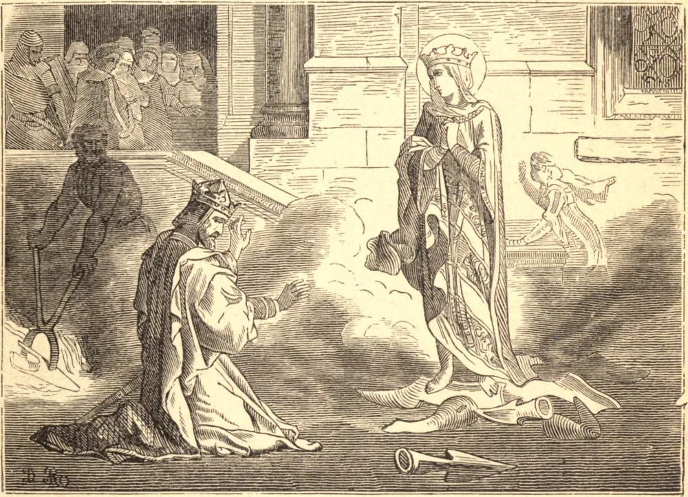

# 3 de março — SANTA CUNEGUNDES, Imperatriz

SANTA CUNEGUNDES foi filha de Siegfried, o primeiro Conde de Luxemburgo, e de Hadeswige, sua piedosa esposa. Eles lhe incutiram desde o berço os mais ternos sentimentos de piedade, e a casaram com São Henrique, Duque da Baviera, que, com a morte do Imperador Otão III, foi escolhido rei dos romanos, e coroado em 6 de junho de 1002. Ela foi coroada em Paderborn no dia de São Lourenço. No ano de 1014 foi com seu esposo a Roma, e recebeu com ele a coroa imperial das mãos do Papa Bento VIII. Antes do casamento, com o consentimento de São Henrique, ela fizera um voto de virgindade. Caluniadores depois fizeram vis acusações contra ela, e a santa imperatriz, para remover o escândalo de tal calúnia, confiando em Deus para provar a sua inocência, caminhou sobre relhas de arado em brasa sem se ferir. O imperador condenou os seus temores demasiado escrupulosos e a sua credulidade, e desde então viveram na mais estrita união de corações, conspirando para promover em tudo a honra de Deus e o avanço da piedade.

Indo certa vez fazer um retiro em Hesse, adoeceu perigosamente, e fez voto de fundar um mosteiro, se sarasse, em Kaffungen, perto de Cassel, na diocese de Paderborn, o que executou de maneira majestosa, dando-o às freiras da Ordem de São Bento. Antes que estivesse concluído, São Henrique faleceu, em 1024. Ela recomendou com fervor a alma dele às orações de outros, especialmente às suas queridas freiras, e exprimiu o seu ardente desejo de unir-se a elas. Já havia esgotado os seus tesouros na fundação de bispados e mosteiros, e no socorro aos pobres, e por isso pouco lhe restava agora para dar. Mas, ainda sedenta de abraçar a perfeita pobreza evangélica, e de renunciar a tudo para servir a Deus sem obstáculo, reuniu grande número de prelados para a dedicação de sua igreja de Kaffungen no dia do aniversário da morte de seu esposo, em 1025; e depois que o evangelho foi cantado na Missa, ofereceu sobre o altar um pedaço da verdadeira cruz, e então, despindo as suas vestes imperiais, revestiu-se de um pobre hábito; cortaram-lhe os cabelos, e o bispo pôs-lhe um véu, e um anel como penhor de sua fidelidade ao seu celeste Esposo. Depois de consagrada a Deus na vida religiosa, parecia ter esquecido inteiramente que fora imperatriz, e comportava-se como a última na casa, persuadida de que era a última diante de Deus. Orava e lia muito, trabalhava com as próprias mãos, e tinha singular prazer em visitar e consolar os enfermos. Assim passou os últimos quinze anos de sua vida. As suas mortificações afinal a reduziram a uma condição muito débil, e trouxeram a sua última doença. Percebendo que preparavam um pano franjado de ouro para cobrir o seu corpo depois da morte, mudou de cor e ordenou que o tirassem; nem pôde ficar tranquila até que lhe prometessem ser sepultada como uma pobre religiosa, em seu hábito. Faleceu em 3 de março de 1040. Seu corpo foi levado a Bamberg e sepultado junto ao de seu esposo. Foi solenemente canonizada por Inocêncio III em 1200.

## Reflexão

O desapego do espírito, ao menos, é necessário àqueles que não podem aventurar-se a uma renúncia efetiva. "Assim, pois, qualquer um de vós", diz Jesus Cristo, "que não renuncia a tudo o que possui, não pode ser meu discípulo."
