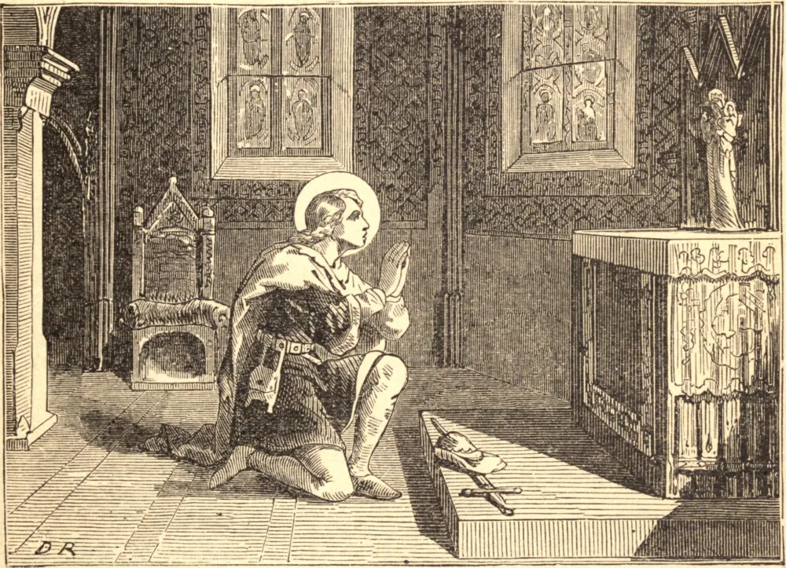

# 4 de março — SÃO CASIMIRO, Rei

CASIMIRO, o segundo filho de Casimiro III, Rei da Polônia, nasceu no ano de 1458. Da guarda de uma mãe virtuosíssima, Isabel da Áustria, passou à tutela de um mestre devotado, o douto e piedoso João Dugloss. Assim animado desde os seus primeiros anos pelo preceito e pelo exemplo, a sua inocência e a sua piedade logo amadureceram na prática da virtude heroica. Aos vinte e cinco anos de idade, enfermo de uma doença prolongada, predisse a hora de sua morte, e preferiu morrer virgem a tomar a vida e a saúde que os médicos lhe ofereciam no estado conjugal. Em meio a uma atmosfera de luxo e magnificência, o jovem príncipe jejuara, vestira cilício, dormira sobre a terra nua, orara de noite, e velara à espera da abertura das portas da igreja ao amanhecer. Tornara-se tão ternamente devotado à Paixão de Nosso Senhor que na Missa parecia inteiramente arrebatado de si mesmo, e a sua caridade para com os pobres e os aflitos não conhecia limites. O seu amor por Nossa Senhora ele o exprimiu em um longo e belo hino, que nos é familiar em nossa própria língua.

Os milagres operados por seu corpo após a morte enchem um volume. Os cegos viam, os coxos andavam, os enfermos eram curados, uma moça morta foi ressuscitada. E certa vez o Santo, na glória, conduziu os seus compatriotas à batalha, e os livrou, por uma vitória gloriosa, das hostes cismáticas russas.

Cento e vinte e dois anos após a sua morte, o túmulo do Santo na catedral de Vilna foi aberto, para que o santo corpo pudesse ser transferido à rica capela de mármore onde agora repousa. O lugar era úmido, e a própria abóbada desfazia-se nas mãos dos operários; contudo, o corpo do Santo, envolto em vestes de seda, foi encontrado inteiro e incorrupto, e exalava uma doce fragrância, que encheu a igreja e reanimou todos os que estavam presentes. Sob a sua cabeça encontrou-se o seu hino a Nossa Senhora, que ele mandara sepultar consigo. Na noite seguinte, três jovens viram uma luz brilhante sair do túmulo aberto e fluir pelas janelas da capela.

**Reflexão**—Que o estudo da vida de São Casimiro nos faça crescer na devoção à puríssima Mãe de Deus — meio seguro de preservar a santa pureza.
