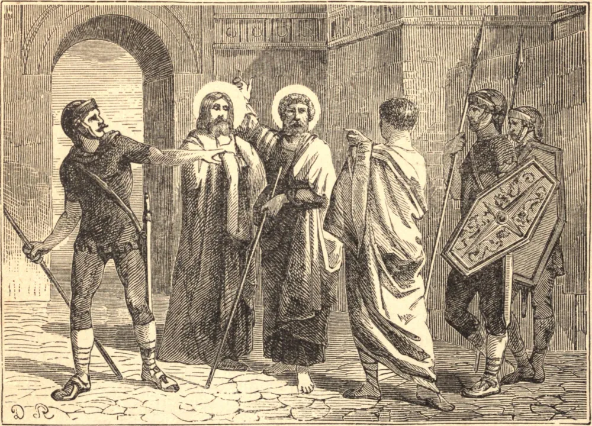

# 5 de março — SANTO ADRIÃO e SANTO ÊUBULO, Mártires

NO sétimo ano da perseguição de Diocleciano, continuada por Galério Maximiano, quando Firmiliano, o mais sanguinário governador da Palestina, havia manchado Cesareia com o sangue de muitos ilustres mártires, Adrião e Êubulo saíram da região chamada Magância em direção a Cesareia, a fim de visitar os santos confessores que ali estavam. Às portas da cidade foram interrogados, como os outros, sobre para onde iam e com que propósito. Confessaram ingenuamente a verdade, e foram levados diante do presidente, que ordenou que fossem torturados e que os seus lados fossem rasgados com ganchos de ferro, e depois os condenou a serem expostos às feras. Dois dias depois, quando os pagãos em Cesareia celebravam a festividade do Gênio público, Adrião foi exposto a um leão, e, não sendo despachado por aquela fera, mas apenas dilacerado, foi afinal morto pela espada. Êubulo foi tratado da mesma maneira dois dias mais tarde. O juiz ofereceu-lhe a liberdade, se sacrificasse aos ídolos; mas o Santo preferiu uma morte gloriosa, e foi o último que padeceu nesta perseguição em Cesareia, a qual já durava doze anos, sob três governadores sucessivos: Flaviano, Urbano e Firmiliano. A vingança divina, perseguindo o cruel Firmiliano, este foi decapitado naquele mesmo ano por seus crimes, por ordem do imperador, como o seu predecessor Urbano o fora dois anos antes.

## Reflexão

É em vão que tomamos o nome de cristãos, ou pretendemos seguir a Cristo, a não ser que levemos as nossas cruzes após Ele. É em vão que esperamos partilhar de sua glória e de seu reino, se não aceitamos a condição. Não podemos chegar ao céu por outra estrada senão aquela que Cristo trilhou, o qual legou a sua cruz a todos os seus eleitos como sua porção e herança neste mundo.
