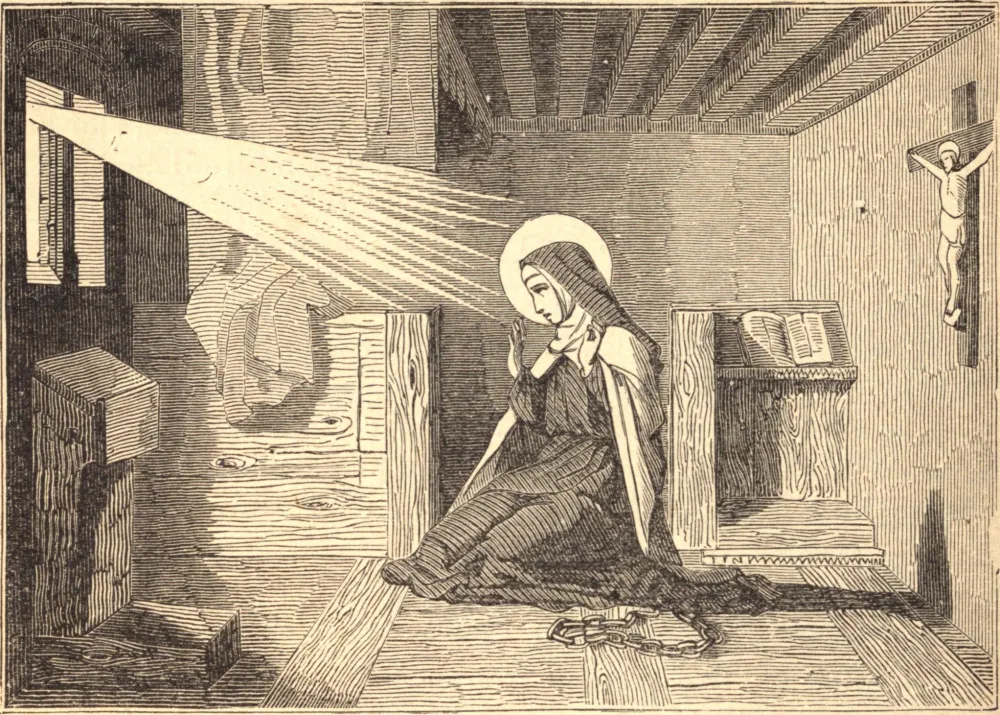

# 6 de março — SANTA COLETA, Virgem

DEPOIS de uma santa infância, Coleta juntou-se a uma sociedade de mulheres devotas chamadas beguinas; mas, não achando o seu estado suficientemente austero, entrou na Terceira Ordem de São Francisco, e viveu numa choupana perto de sua igreja paroquial de Corbie, na Picardia. Ali havia passado quatro anos de extraordinária penitência quando São Francisco, numa visão, ordenou-lhe que empreendesse a reforma de sua Ordem, então muito relaxada. Munida da devida autoridade, estabeleceu a sua reforma por grande parte da Europa, e, apesar da mais violenta oposição, fundou dezessete conventos da estrita observância. Pela mesma admirável prudência, ajudou a curar o grande cisma que então afligia a Igreja. Os Padres reunidos em concílio em Constança estavam em dúvida sobre como tratar os três pretendentes à tiara — João XXIII, Bento XIII e Gregório XII. Nesta crise, Coleta, juntamente com São Vicente Ferrer, escreveu aos Padres para que depusessem Bento XIII, o único que recusava o seu consentimento a uma nova eleição. Isto foi feito, e Martinho V foi eleito, para grande bem da Igreja. Coleta igualmente ajudou o Concílio de Basileia com os seus conselhos e orações; e quando, mais tarde, Deus lhe revelou o espírito de revolta que se erguia, ela advertiu os bispos e legados a se retirarem do concílio. Santa Coleta nunca cessou de orar pela Igreja, enquanto os demônios, por sua vez, nunca cessaram de assaltá-la. Enxameavam ao redor dela como hediondos insetos, zumbindo e ferroando a sua pele delicada. Traziam para a sua cela os cadáveres em decomposição de criminosos públicos, e, assumindo eles próprios formas monstruosas, desferiam-lhe golpes selvagens; ou apareciam sob o aspecto mais sedutor, e a tentavam, por muitos enganos, a pecar. Santa Coleta queixou-se certa vez a Nosso Senhor de que os demônios a impediam de orar. "Cessa, então", disse-lhe o demônio, "as tuas orações ao grande Mestre da Igreja, e nós cessaremos de atormentar-te; pois tu nos atormentas mais com as tuas orações do que nós a ti." Contudo, a virgem de Cristo triunfou tanto das suas ameaças quanto das suas seduções, e dizia que contaria por mais infeliz de sua vida aquele dia em que nada padecesse por seu Deus. Faleceu em 6 de março de 1447, num arroubo de intercessão pelos pecadores e pela Igreja.

## Reflexão

Uma das maiores provas de ser um bom católico é o zelo pela Igreja e a devoção ao Vigário de Cristo.
