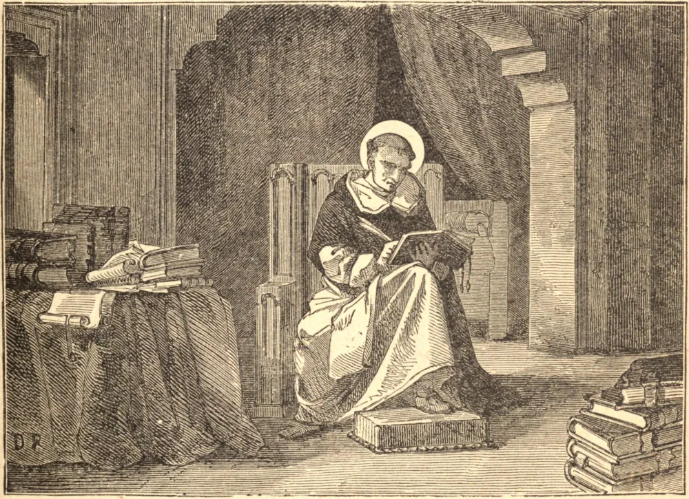

# 7 de março — SÃO TOMÁS DE AQUINO

SÃO TOMÁS nasceu de pais nobres em Aquino, na Itália, em 1226. Aos dezenove anos recebeu o hábito dominicano em Nápoles, onde estudava. Capturado por seus irmãos a caminho de Paris, sofreu dois anos de cativeiro no castelo deles, em Rocca-Secca; mas nem as carícias de sua mãe e de suas irmãs, nem as ameaças e estratagemas de seus irmãos, puderam abalá-lo em sua vocação.

Enquanto São Tomás estava em reclusão em Rocca-Secca, seus irmãos esforçaram-se por enredá-lo no pecado, mas a tentativa apenas terminou no triunfo de sua pureza. Arrancando da lareira um tição em chamas, o Santo expulsou de seu aposento a infeliz criatura que ali haviam ocultado. Então, marcando uma cruz na parede, ajoelhou-se para orar, e logo, sendo arrebatado em êxtase, um anjo o cingiu com um cordão, em sinal do dom da castidade perpétua que Deus lhe havia concedido. A dor causada pelo cíngulo foi tão aguda que São Tomás soltou um grito penetrante, que trouxe os seus guardas ao quarto. Mas ele nunca contou esta graça a ninguém, senão somente ao Padre Reinaldo, seu confessor, pouco antes de sua morte. Daí se originou a Confraria da "Milícia Angélica", para a preservação da virtude da castidade.

Tendo afinal escapado, São Tomás foi a Colônia estudar sob o Beato Alberto Magno, e depois disso a Paris, onde por muitos anos ensinou filosofia e teologia. A Igreja sempre venerou os seus numerosos escritos como um tesouro de sã doutrina; e, ao nomeá-lo o Doutor Angélico, indicou que a sua ciência é mais divina do que humana. Os mais raros dons de inteligência uniam-se nele à mais terna piedade. A oração, dizia ele, ensinara-lhe mais do que o estudo. A sua singular devoção ao Santíssimo Sacramento resplandece no Ofício e nos hinos para Corpus Christi, que ele compôs. Às palavras miraculosamente proferidas por um crucifixo em Nápoles — "Bem escreveste a meu respeito, Tomás. Que te darei por recompensa?" — ele respondeu: "Nada senão a Vós mesmo, ó Senhor."

Faleceu em Fossa-Nuova, em 1274, a caminho do Concílio Geral de Lião, ao qual o Papa Gregório X o havia convocado.

**Reflexão**—O conhecimento de Deus é para todos, mas tesouros ocultos estão reservados para aqueles que sempre seguiram o Cordeiro.
