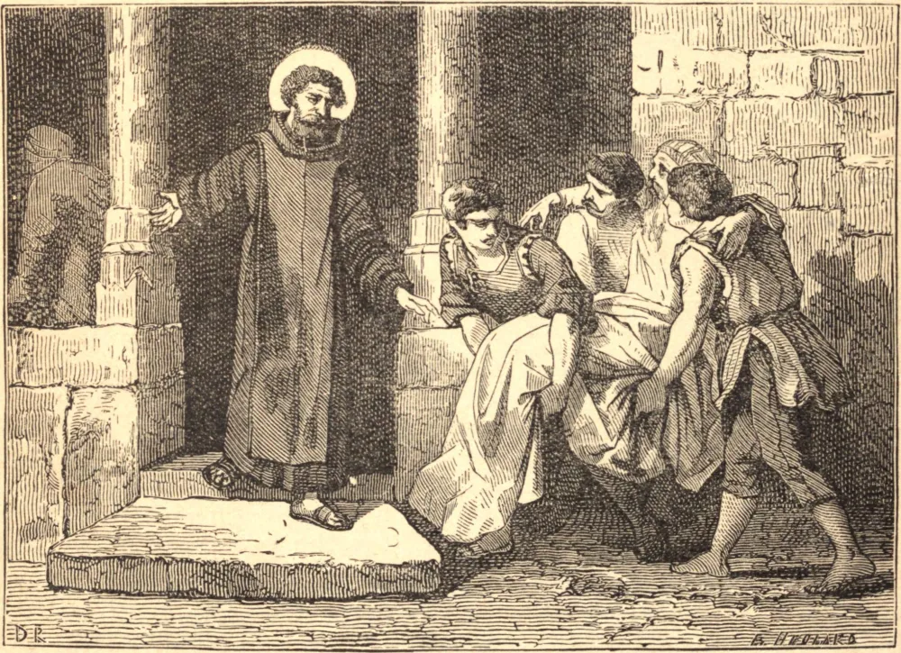

# 8 de março — SÃO JOÃO DE DEUS

NADA na vida juvenil de João prenunciava a sua futura santidade. Ainda menino, fugiu de seu lar em Portugal, apascentou ovelhas e gado na Espanha, e serviu como soldado contra os franceses, e depois contra os turcos. Por volta dos quarenta anos de idade, sentindo remorso por sua vida desregrada, resolveu dedicar-se ao resgate dos escravos cristãos na África, e para lá foi com a família de um nobre exilado, a qual sustentava com o seu trabalho. Ao regressar à Espanha, procurou fazer o bem vendendo imagens e livros santos a baixos preços. Afinal soou a hora da graça. Em Granada, um sermão do célebre João de Ávila abalou-lhe a alma até as profundezas, e as suas manifestações de horror a si mesmo foram tão extraordinárias que foi levado ao asilo como louco. Ali ocupou-se em servir aos enfermos. Ao sair, começou a recolher os pobres sem teto, e a sustentá-los com o seu trabalho e com a mendicância. Certa noite, São João encontrou nas ruas um pobre homem que parecia à beira da morte, e, como era seu costume, levou-o ao hospital, deitou-o num leito, e foi buscar água para lhe lavar os pés. Tendo-os lavado, ajoelhou-se para beijá-los, e estremeceu de pavor: os pés estavam trespassados, e a marca dos cravos brilhava com um resplendor sobrenatural. Ergueu os olhos para olhar, e ouviu estas palavras: "João, a Mim fazes tudo o que fazes aos pobres em meu nome: Eu estendo a minha mão pela esmola que dás; a Mim revestes, meus são os pés que lavas." E então a graciosa visão desapareceu, deixando São João cheio, ao mesmo tempo, de confusão e de consolação. O bispo tornou-se o patrono do Santo, e deu-lhe o nome de João de Deus. Quando o seu hospital pegou fogo, viu-se João correndo de um lado a outro, ileso em meio às chamas, até que houvesse resgatado todos os seus pobres. Após dez anos passados a serviço dos que sofriam, a vida do Santo encerrou-se de modo digno. Lançou-se ao rio Xenil para salvar um menino que se afogava, e morreu, em 1550, de uma doença trazida pela tentativa, aos cinquenta e cinco anos de idade.

## Reflexão

Deus muitas vezes recompensa os homens pelas obras que lhe são agradáveis dando-lhes graça e oportunidade de fazer outras obras ainda mais elevadas. São João de Deus costumava atribuir a sua conversão, e as graças que o capacitaram a fazer obras tão grandes, à sua caridade abnegada na África.
