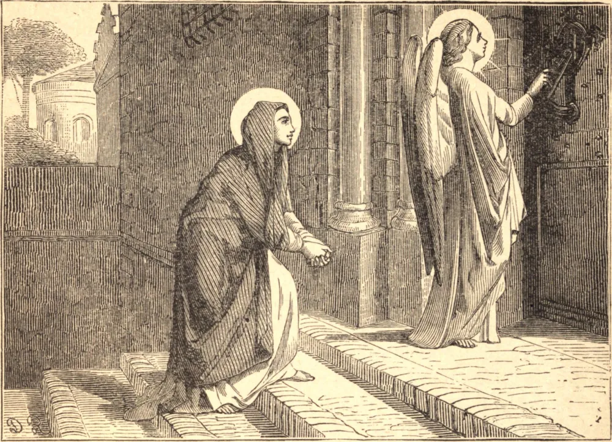

# 9 de março — SANTA FRANCISCA ROMANA

FRANCISCA nasceu em Roma em 1384. Seus pais eram de alta linhagem. Eles contrariaram o seu desejo de tornar-se freira, e, aos doze anos de idade, casaram-na com Lourenço Ponziano, um nobre romano. Durante os quarenta anos de sua vida conjugal, jamais tiveram um desentendimento. Embora passasse os seus dias no recolhimento e na oração, atendia prontamente a todo dever doméstico, dizendo: "Uma mulher casada deve deixar Deus no altar para encontrá-lo em seus cuidados domésticos"; e certa vez encontrou o versículo de um salmo, no qual fora assim interrompida quatro vezes, completado para ela em letras de ouro.

O seu alimento comum era pão seco. Secretamente trocava com os mendigos boa comida por suas duras côdeas; a sua bebida era água, e o seu cálice, um crânio humano.

Durante a invasão de Roma, em 1413, Ponziano foi banido, os seus bens confiscados, a sua casa destruída, e o seu filho mais velho levado como refém. Francisca via nessas perdas apenas o dedo de Deus, e bendizia o seu santo nome. Quando a paz foi restabelecida, Ponziano recuperou os seus bens, e Francisca fundou as Oblatas. Após a morte de seu esposo, descalça e com um cordão ao pescoço, suplicou a admissão à comunidade, e logo foi eleita Superiora.

Vivia sempre na presença de Deus, e, entre muitas visões, foi-lhe dada a constante visão do seu anjo da guarda, que difundia ao redor de si tal brilho que a Santa podia ler o seu Ofício da meia-noite somente por essa luz. Ele a amparava na hora da tentação, e a dirigia em toda boa ação. Mas, quando ela era levada a algum defeito, ele se desvanecia de sua vista; e quando se proferiam diante dela algumas palavras levianas, ele cobria o rosto de vergonha. Faleceu no dia que havia predito, 9 de março de 1440.

**Reflexão**—Deus designou um anjo para guardar a cada um de nós, a cujas advertências estamos obrigados a atender. Ouçamos a sua voz aqui, e o veremos no porvir, quando ele nos conduzir diante do trono de Deus.
