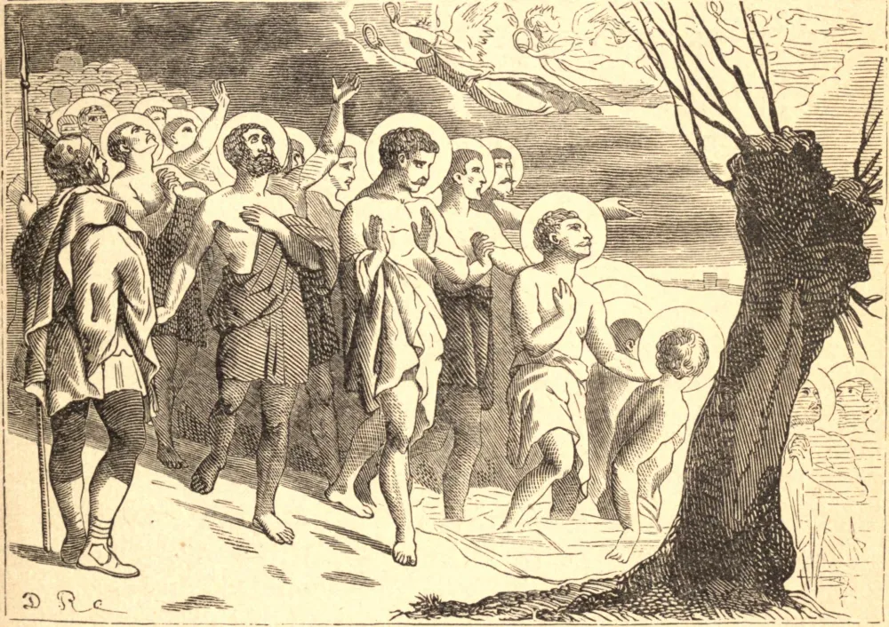

# 10 de março — OS QUARENTA MÁRTIRES DE SEBASTE

OS QUARENTA MÁRTIRES eram soldados aquartelados em Sebaste, na Armênia, por volta do ano 320. Quando se ordenou à sua legião que oferecesse sacrifício, eles se separaram dos demais e formaram uma companhia de mártires. Depois de terem sido rasgados por açoites e ganchos de ferro, foram acorrentados juntos e levados a uma morte lenta. Era um inverno cruel, e foram condenados a jazer nus sobre a superfície gelada de um lago a céu aberto, até que estivessem mortos pelo frio. Mas correram destemidos ao lugar do seu combate, despiram alegremente as suas vestes, e com uma só voz suplicaram a Deus que mantivesse as suas fileiras intactas. "Quarenta", clamaram eles, "viemos combater: concedei que quarenta sejam coroados." Havia banhos quentes ali perto, prontos para qualquer um dentre eles que negasse a Cristo. Os soldados que vigiavam viram anjos descendo com trinta e nove coroas, e, enquanto um deles se admirava da deficiência no número, um dos confessores perdeu o ânimo, renunciou à sua fé e, rastejando para o fogo, morreu corpo e alma no lugar onde esperava alívio. Mas o soldado foi inspirado a confessar a Cristo e a tomar o seu lugar, e novamente o número de quarenta ficou completo. Permaneceram firmes enquanto os seus membros enrijeciam e congelavam, e morreram um a um. Entre os Quarenta havia um jovem soldado que resistiu por mais tempo ao frio, e quando os oficiais vieram carregar os corpos mortos, encontraram-no ainda respirando. Foram movidos de piedade, e quiseram deixá-lo vivo, na esperança de que ele ainda mudasse de ideia. Mas a sua mãe estava ali, e esta valente mulher não podia suportar ver o seu filho separado do grupo dos mártires. Exortou-o a perseverar, e ergueu o seu corpo congelado para dentro da carroça. Ele mal conseguiu fazer um sinal de reconhecimento, e foi levado, para ser lançado às chamas com os corpos mortos de seus irmãos.

## Reflexão

Todos os que vivem a vida da graça são um só em Cristo. Mas, além disto, há muitas particularidades — de religião, de vida em comunidade, ou ao menos de aspirações na oração e nas obras piedosas. Dai graças a Deus se Ele vos uniu a outros por esses laços espirituais; lembrai-vos do papel que tendes a sustentar, e orai para que o vínculo que vos une aqui possa durar pela eternidade.
