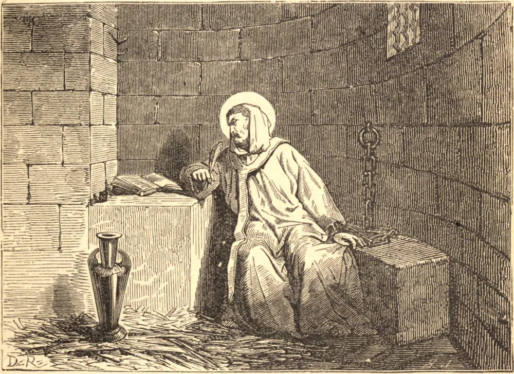

# 11 de março — SANTO EULÓGIO, Mártir

SANTO EULÓGIO era de uma família senatorial de Córdova, naquele tempo a capital dos mouros na Espanha. O nosso Santo foi educado entre o clero da Igreja de São Zoilo, um mártir que padeceu com outros dezenove sob Diocleciano. Ali distinguiu-se por sua virtude e seu saber, e, feito sacerdote, foi colocado à frente da principal escola eclesiástica de Córdova. Uniu aos seus estudos assídua vigília, jejum e oração, e a sua humildade, mansidão e caridade granjearam-lhe o afeto e o respeito de todos.

Durante a perseguição levantada contra os cristãos no ano de 850, Santo Eulógio foi lançado na prisão, e ali escreveu a sua *Exortação ao Martírio*, dirigida às virgens Flora e Maria, que foram decapitadas em 24 de novembro de 851. Seis dias após a morte delas, Eulógio foi posto em liberdade. No ano de 852, vários outros padeceram igual martírio. Santo Eulógio animou todos esses mártires aos seus triunfos, e foi o sustentáculo daquele atribulado rebanho.

Falecendo o Arcebispo de Toledo em 858, Santo Eulógio foi eleito para sucedê-lo; mas houve algum obstáculo que o impediu de ser consagrado, embora ele não sobrevivesse dois meses à sua eleição.

Uma virgem, de nome Leocrícia, de família nobre entre os mouros, fora instruída desde a infância na religião cristã por uma de suas parentes, e batizada em segredo. Seu pai e sua mãe a maltratavam muito, e a açoitavam dia e noite para forçá-la a renunciar à Fé. Tendo dado a conhecer a sua condição a Santo Eulógio e a sua irmã Anulona, dando a entender que desejava ir para onde pudesse exercer livremente a sua religião, eles secretamente lhe proporcionaram os meios de fugir, e a ocultaram por algum tempo entre amigos fiéis. Mas o caso afinal foi descoberto, e todos foram levados diante do cádi, que ameaçou mandar açoitar Eulógio até a morte. O Santo disse-lhe que os seus tormentos de nada serviriam, pois ele jamais mudaria de religião. Diante disso, o cádi deu ordens para que ele fosse conduzido ao palácio e apresentado perante o conselho do rei. Eulógio começou a propor-lhes ousadamente as verdades do Evangelho. Mas, para impedi-los de ouvi-lo, o conselho condenou-o imediatamente a perder a cabeça.

Enquanto o conduziam à execução, um dos guardas deu-lhe um golpe no rosto, por ter falado contra Maomé; ele virou a outra face, e pacientemente recebeu um segundo. Recebeu o golpe da morte com grande alegria, em 11 de março de 859. Santa Leocrícia foi decapitada quatro dias depois dele, e o seu corpo lançado no rio Guadalquivir, mas retirado pelos cristãos.

**Reflexão**—Pedi a Deus, pela intercessão destes santos mártires, o dom da perseverança. O exemplo deles vos fornecerá uma admirável regra para obter este dom que tudo coroa. Lembrai-vos de que renunciastes ao mundo e ao demônio de uma vez por todas no vosso Batismo. Não hesiteis; não olheis para trás; não escuteis sugestões contra a fé ou a virtude; mas avançai, dia após dia, pela estrada que escolhestes, para Deus, que é a vossa porção para sempre.
