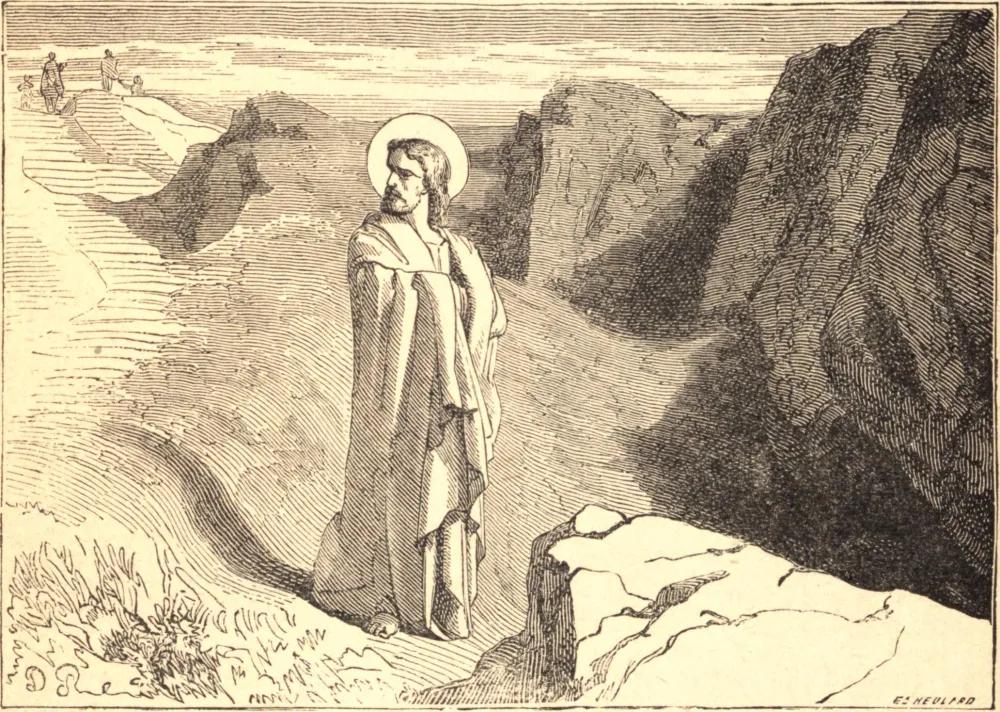

# 12 de março — SÃO GREGÓRIO MAGNO

GREGÓRIO era um romano de nobre nascimento, e, ainda jovem, foi governador de Roma. Com a morte de seu pai, deu a sua grande riqueza aos pobres, transformou a sua casa no monte Célio num mosteiro, que agora leva o seu nome, e por alguns anos viveu como um perfeito monge. O Papa o tirou de seu retiro para fazê-lo um dos sete diáconos de Roma; e ele prestou grande serviço à Igreja por muitos anos como aquilo que hoje chamamos Núncio na corte imperial de Constantinopla. Enquanto ainda era monge, o santo foi impressionado por alguns meninos que estavam expostos à venda em Roma, e ouviu com tristeza que eram pagãos. "E de que raça são eles?", perguntou. "São anglos." "Dignos, em verdade, de serem Anjos de Deus", disse ele. "E de que província?" "De Deira", foi a resposta. "Verdadeiramente devemos arrancá-los da ira de Deus. E qual é o nome do seu rei?" "Chama-se Ella." "Está bem", disse Gregório; "Aleluia deve ser cantado em sua terra a Deus." Obteve logo a permissão do Papa, e já havia partido para converter os ingleses, quando os murmúrios do povo levaram o Papa a chamá-lo de volta. Ainda assim, os anglos não foram esquecidos, e um dos primeiros cuidados do Santo como Papa foi enviar de seu próprio mosteiro Santo Agostinho e outros monges à Inglaterra. Com a morte do Papa Pelágio II, Gregório foi compelido a assumir o governo da Igreja, e, por catorze anos, o seu pontificado foi um modelo perfeito de regência eclesiástica. Curou cismas; reavivou a disciplina; salvou a Itália convertendo os selvagens lombardos arianos que a devastavam; auxiliou na conversão dos godos espanhóis e franceses, que também eram arianos; e reacendeu na Britânia a luz da Fé, que os ingleses haviam apagado no sangue. Pôs em ordem as orações e o canto da Igreja, guiou e consolou os seus pastores com inúmeras cartas, e pregou incessantemente, do modo mais eficaz por seu próprio exemplo. Faleceu no ano de 604, esgotado pelas austeridades e pelos trabalhos; e a Igreja o conta entre os seus quatro grandes doutores, e o venera como São Gregório Magno.

## Reflexão

Os campeões da fé provam a verdade do seu ensino não menos pela santidade de suas vidas do que pela força de seus argumentos. Nunca esqueçais que, para converter os outros, deveis primeiro cuidar de vossa própria alma.
